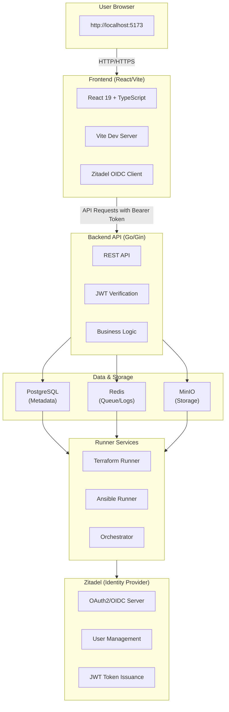
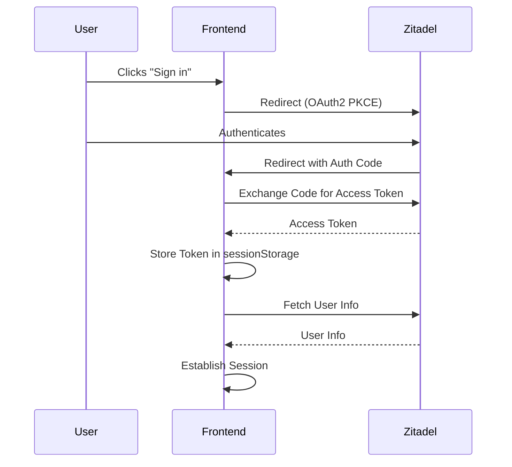
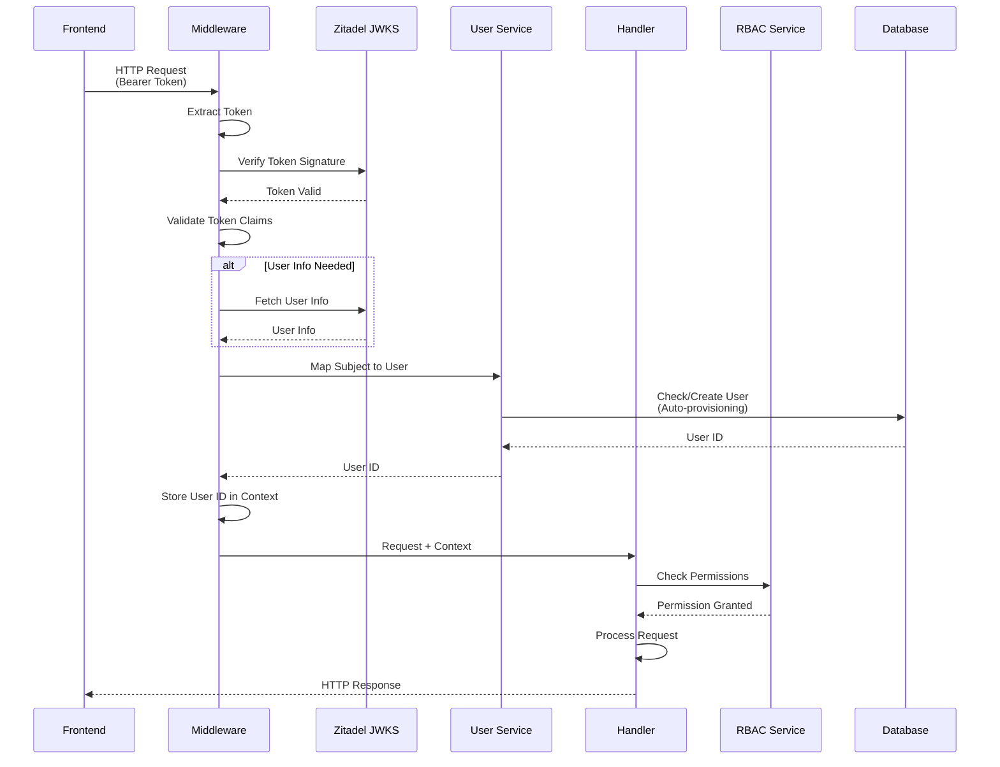
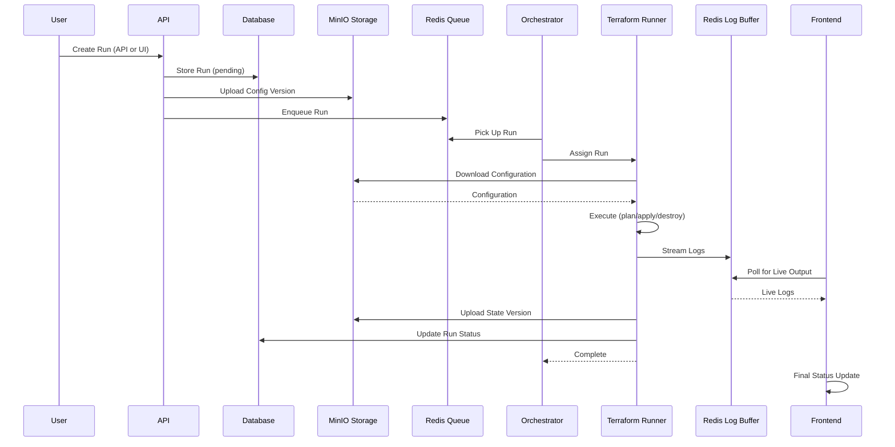
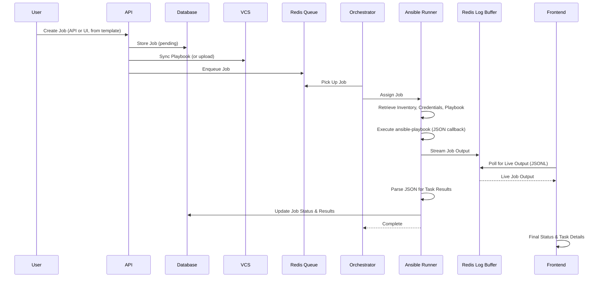
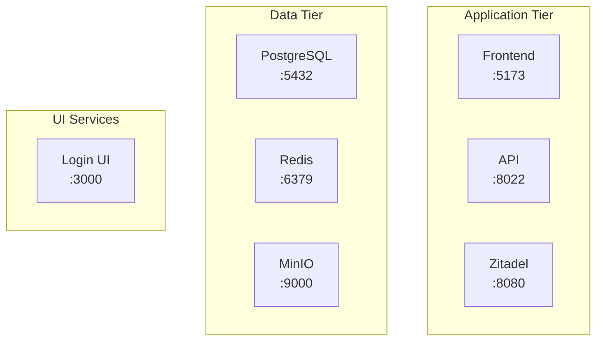
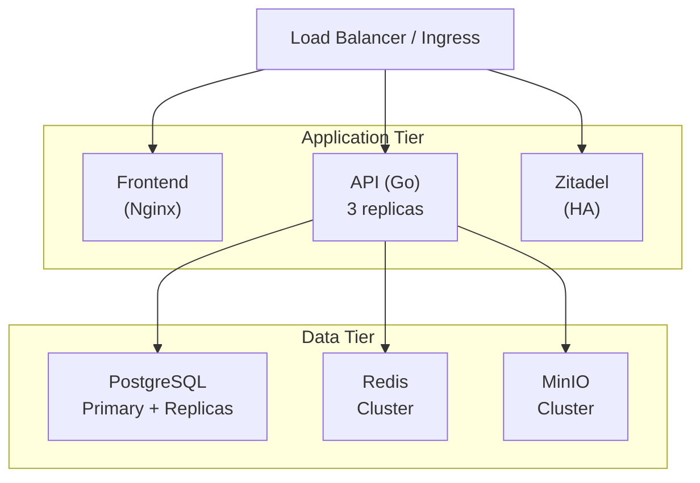

# Architecture Overview

This document provides a high-level overview of the Stackweaver Orchestration Platform architecture.

## System Architecture

## Supported IaC Tools

### Terraform

- **Workspace Management**: Full TFE-compatible workspace lifecycle
- **Run Execution**: Plan, apply, and destroy operations
- **State Management**: Versioned state storage in MinIO
- **Variable Management**: Workspace and variable set support
- **Registry**: Private module and provider registry
- **VCS Integration**: GitHub App and Azure DevOps for automatic configuration sync

### Ansible

- **Playbook Management**: VCS-synced and uploaded playbooks
- **Inventory Management**: Static, dynamic, and VCS-based inventories
- **Job Templates**: Reusable job configurations
- **Job Execution**: Native `ansible-playbook` execution
- **Credential Management**: Encrypted credential storage
- **Scheduling**: Automated job scheduling
- **Live Output**: Real-time job output streaming (JSONL format)
- **Galaxy Collections**: Automatic collection installation

## Component Overview

### Frontend

**Technology Stack**:
- **Framework**: React 19 with TypeScript
- **Build Tool**: Vite
- **Routing**: React Router v7
- **State Management**: React Context API
- **UI Components**: shadcn/ui (Tailwind CSS)
- **Authentication**: Zitadel OIDC PKCE Flow

**Key Features**:
- Single Page Application (SPA)
- Client-side routing
- Token-based authentication
- Real-time session management
- Responsive UI
- Terraform workspace management
- Ansible playbook and job management
- Live run/job output streaming
- Activity feed and notifications

**Directory Structure**: See `frontend/` directory structure in the repository. Key directories:
- `src/api/` - API client and types (see `frontend/src/api/client.ts`)
- `src/components/` - Reusable React components
- `src/contexts/` - React contexts (Auth, Organization, Theme, Notification, RunDisplayPreferences)
- `src/lib/` - Utilities (Zitadel, utils)
- `src/pages/` - Route pages
- `src/App.tsx` - Main app component

### Backend API

**Technology Stack**:
- **Language**: Go 1.25+
- **Framework**: Gin (HTTP web framework)
- **ORM**: GORM (database ORM)
- **Authentication**: Zitadel OIDC JWT verification
- **Database**: PostgreSQL
- **Cache/Queue**: Redis (queues, log buffering)
- **Storage**: MinIO (S3-compatible object storage)

**Key Features**:
- RESTful API design (v2 primary)
- JWT token verification
- Auto-user provisioning
- Team-based RBAC (Role-Based Access Control)
- Rate limiting
- CORS support
- Terraform Registry API (TFE-compatible)
<!-- - Ansible Automation Platform integration -->
- VCS connections (GitHub App, Azure DevOps)

**Directory Structure**: See `backend/` directory structure in the repository. Key directories:
- `cmd/api/` - Application entry point
- `cmd/runner/` - Terraform runner service
- `cmd/ansible-runner/` - Ansible runner service
- `cmd/orchestrator/` - Job orchestrator service
- `internal/api/v2/` - API v2 implementation (primary)
  - `handlers/` - HTTP request handlers (see `backend/internal/api/v2/handlers/`)
    - `terraform/` - Terraform-specific handlers (workspaces, runs, state)
    - `ansible/` - Ansible-specific handlers (playbooks, jobs, inventories)
  - `middleware/` - HTTP middleware (auth, CORS, rate limit, RBAC, validation)
  - `routes/` - Route definitions (see `backend/internal/api/v2/routes/routes.go`)
- `internal/models/` - Database models (Terraform, Ansible, Registry)
- `internal/repository/` - Data access layer
- `internal/services/` - Business logic
  - `activity/` - Activity and audit trail tracking
  - `ansible/` - Ansible execution service
  - `apikey/` - API key generation and validation
  - `audit/` - Compliance auditing
  - `auth/` - Authentication service (JWT, TFE tokens, auto-provisioning)
  - `logbuffer/` - Log buffering for streaming
  - `logparser/` - Execution log parsing
  - `oidc/` - OIDC workload identity
  - `profile/` - User profile management
  - `rbac/` - Team-based RBAC service
  - `registry/` - Terraform Registry service
  - `runner/` - Runner health checks and job assignment
  - `sessions/` - Session management
  - `state/` - State version management
  - `team_sync/` - Automatic SSO team assignment
  - `terraform/` - Terraform execution service
  - `variable/` - Variable management
  - `vcs/` - VCS connection service (GitHub App, Azure DevOps)
- `internal/storage/` - Object storage interface (MinIO)
- `internal/queue/` - Queue interface (Redis)

### Database (PostgreSQL)

**Schema Overview**:
- **Organizations**: Top-level organizational units
- **Projects**: Projects within organizations
- **Teams**: Team-based access control (TFE-compatible)
- **Users**: Local user accounts (mapped from Zitadel)
- **Terraform Resources**:
  - **Workspaces**: Terraform workspaces
  - **Runs**: Terraform execution runs (plan, apply, destroy)
  - **Configuration Versions**: Workspace configuration versions
  - **State Versions**: Terraform state versions
  - **Variables**: Workspace variables (encrypted)
  - **Variable Sets**: Reusable variable sets
- **Ansible Resources**:
  - **Playbooks**: Ansible playbook definitions
  - **Inventories**: Static and dynamic inventory sources
  - **Job Templates**: Reusable job configurations
  - **Jobs**: Ansible job executions
  - **Credentials**: Encrypted Ansible credentials
  - **Schedules**: Automated job scheduling
  - **Workflows**: Workflow templates (nodes, edges)
- **Registry Resources**:
  - **Modules**: Terraform module registry
  - **Providers**: Terraform provider registry
  - **Module Versions**: Module version tracking
  - **Provider Versions**: Provider version tracking
- **VCS Resources**:
  - **VCS Connections**: GitHub App and Azure DevOps connections
  - **Webhook Events**: VCS event tracking
- **Platform Resources**:
  - **API Keys**: API authentication tokens
  - **TFE Tokens**: Terraform Enterprise-compatible API tokens
  - **Azure OIDC Configurations**: Workload identity federation
  - **Terraform Versions**: Terraform version catalog
  - **Runners**: Runner agent registration and status
  - **GPG Keys**: Provider signing keys
- **Audit Logs**: Activity audit trail

**Key Design Decisions**:
- UUID primary keys for all entities
- Soft deletes (future)
- Timestamps (`created_at`, `updated_at`)
- Foreign key relationships
- Indexes on frequently queried columns

### Identity Provider (Zitadel)

**Features**:
- OAuth2/OIDC provider
- User management
- Organization management
- JWT token issuance
- Login UI (separate service)

**Configuration**:
- External domain: `localhost:8080`
- Login UI: `http://localhost:3000/ui/v2/login`
- OAuth2 applications for frontend and backend

## Data Flow

### Authentication Flow

<strong>Flow Steps (Legend)</strong>

1. User clicks "Sign in" → Frontend redirects to Zitadel
2. User authenticates with Zitadel
3. Zitadel redirects back with authorization code
4. Frontend exchanges code for access token
5. Frontend stores token in `sessionStorage`
6. Frontend fetches user info from Zitadel
7. Frontend establishes session

See [Authentication Documentation](../internal/overviews/authentication.md) for details.

### API Request Flow

<strong>Flow Steps (Legend)</strong>

1. Frontend makes API request with Bearer token
2. Backend middleware extracts token
3. Backend verifies token signature with Zitadel JWKS
4. Backend validates token claims
5. Backend fetches user info from Zitadel (if needed)
6. Backend maps Zitadel subject to local user (auto-provisioning)
7. Backend stores user ID in context
8. Handler processes request with RBAC checks
9. Handler returns response

### Terraform Run Execution Flow

<strong>Flow Steps (Legend)</strong>

1. User creates run via API or UI
2. Run stored in database with `pending` status
3. Configuration version uploaded to MinIO storage
4. Orchestrator picks up run from Redis queue
5. Orchestrator assigns run to available Terraform runner
6. Runner downloads configuration from storage
7. Runner executes Terraform operation (plan/apply/destroy)
8. Runner streams logs to Redis log buffer
9. Frontend polls Redis for live log output
10. Runner uploads state version to storage (on completion)
11. Runner updates run status in database
12. Frontend receives final status update

### Ansible Job Execution Flow

<strong>Flow Steps (Legend)</strong>

1. User creates job via API or UI (from job template)
2. Job stored in database with `pending` status
3. Playbook content synced from VCS or uploaded
4. Orchestrator picks up job from Redis queue
5. Orchestrator assigns job to available Ansible runner
6. Runner retrieves inventory, credentials, and playbook
7. Runner executes `ansible-playbook` with JSON callback
8. Runner streams job output to Redis log buffer
9. Frontend polls Redis for live job output (JSONL format)
10. Runner parses JSON callback for structured task results
11. Runner updates job status and results in database
12. Frontend receives final status and task details

## Security Architecture

### Authentication

- **OAuth2 Authorization Code Flow with PKCE**: Prevents authorization code interception
- **JWT Tokens**: Signed by Zitadel, verified using JWKS
- **Token Storage**: `sessionStorage` (cleared on tab close)
- **Token Validation**: Every API request verifies token signature and claims

### Authorization

- **Team-Based RBAC**: Team-based access control (TFE-compatible)
  - Teams have organization, project, and workspace-level permissions
  - Users belong to teams, inheriting team permissions
  - Default teams: "owners" (full access) and "viewers" (read-only)
- **Resource-Level Permissions**: Users can only access resources they have permission for
- **Auto-User Provisioning**: Users are automatically created on first login from Zitadel

### Network Security

- **CORS**: Configured for specific origins
- **Rate Limiting**: Per-IP rate limiting on all endpoints
- **HTTPS**: Required in production (TLS termination at load balancer)

### Data Security

- **Encryption at Rest**: Database encryption (future)
- **Encryption in Transit**: TLS for all connections
- **Sensitive Variables**: Encrypted in database using AES-256-GCM
- **Ansible Credentials**: Encrypted in database using AES-256-GCM
- **Storage**: MinIO provides encryption at rest (configurable)

## Deployment Architecture

### Development (Docker Compose)

**Network Mode**: `host` (all services on localhost)

### Production (Kubernetes)

## Technology Choices

### Why Go for Backend?

- **Performance**: Fast compilation and execution
- **Concurrency**: Excellent goroutine support for async operations
- **Type Safety**: Strong typing reduces runtime errors
- **Ecosystem**: Rich standard library and package ecosystem
- **Deployment**: Single binary deployment

### Why React for Frontend?

- **Component-Based**: Reusable, maintainable UI components
- **Ecosystem**: Large ecosystem of libraries and tools
- **Developer Experience**: Great tooling (Vite, TypeScript)
- **Performance**: Virtual DOM and efficient rendering
- **Community**: Large, active community

### Why Zitadel?

- **Open Source**: Self-hostable identity provider
- **OIDC/OAuth2**: Industry-standard protocols
- **Features**: User management, organizations, RBAC
- **Integration**: Easy integration with Go and React
- **UI**: Built-in login UI

### Why PostgreSQL?

- **ACID Compliance**: Strong consistency guarantees
- **JSON Support**: JSONB for flexible schemas
- **Performance**: Excellent query performance
- **Ecosystem**: Rich tooling and extensions
- **Reliability**: Battle-tested, production-ready

## API Design Principles

### RESTful Design

- **Resources**: Nouns (organizations, projects, workspaces, runs)
- **HTTP Methods**: GET (read), POST (create), PUT (update), DELETE (delete)
- **Status Codes**: Proper HTTP status codes (200, 201, 204, 400, 401, 404, 500)
- **URLs**: Hierarchical resource structure (`/organizations/:id/projects`)

### Versioning

- **Primary API**: `/api/v2/...` (TFE-compatible where applicable)
- **Terraform Registry**: `.well-known/terraform.json` for service discovery

### Pagination

- **JSON:API Style** (most endpoints): `page[number]` and `page[size]` query parameters
- **Response Format**: `{ data: [...], meta: { pagination: { current-page, page-size, total-count, total-pages } } }`

### Error Handling

- **JSON:API Format**: `{ errors: [{ status: "...", title: "...", detail: "..." }] }` for most endpoints
- **Simple Format**: `{ error: "message" }` used by some internal endpoints
- **Descriptive Messages**: Human-readable error messages
- **Status Codes**: Appropriate HTTP status codes

## Additional Components

### Storage (MinIO)

- **Purpose**: Object storage for Terraform state, configuration versions, and registry artifacts
- **Implementation**: S3-compatible interface
- **Buckets**: Separate buckets for state, configurations, and registry
- **Features**: Pre-signed URLs for secure access, encryption at rest support

### Queue (Redis)

- **Purpose**: Job queue for Terraform runs and Ansible jobs
- **Implementation**: Redis-based queue with LPush/BRPop pattern
- **Features**: 
  - Log buffering for live output streaming
  - Job queuing for runners
  - TTL-based log expiration (24 hours)

### Runners

- **Terraform Runner** (`cmd/runner/`): Executes Terraform plans/applies/destroys
- **Ansible Runner** (`cmd/ansible-runner/`): Executes Ansible playbooks
- **Orchestrator** (`cmd/orchestrator/`): Manages job scheduling and runner assignment

### Terraform Registry

- **Service Discovery**: `.well-known/terraform.json` endpoint
- **Module Registry**: Private Terraform module registry (TFE-compatible)
- **Provider Registry**: Private Terraform provider registry
- **Publishing**: VCS webhook-based module/provider publishing

### VCS Integration

- **GitHub App**: Primary VCS integration method
- **Azure DevOps**: Entra ID OAuth2 integration
- **Features**: Automatic token management, repository access control, webhook handling
- **Use Cases**: Playbook sync, module publishing, workspace configuration sync

## Future Architecture Enhancements

### Microservices (Future)

- **API Gateway**: Single entry point, routing to services
- **Notification Service**: Multi-channel notifications (Slack, Email, Webhooks)
- **Policy Service**: Policy evaluation (OPA)
- **Metrics Service**: Aggregated metrics and monitoring

### Event-Driven Architecture (Future)

- **Event Bus**: Pub/sub for domain events (using Redis Streams)
- **Event Sourcing**: Audit trail and state reconstruction
- **Webhooks**: Outbound webhook notifications

### Plugin System (Future)

- **IaC Plugins**: Pulumi, OpenTofu
- **VCS Plugins**: GitLab, Bitbucket, Gitea
- **Storage Plugins**: S3, Azure Blob, GCS (beyond MinIO)
- **Notification Plugins**: Slack, Email, Webhooks

## References

- [Authentication Documentation](../internal/overviews/authentication.md)
- [Frontend API Reference](../internal/api-reference/frontend-api-reference.md)
- [Backend API Reference](../internal/api-reference/backend-api-reference.md)
- [Zitadel Documentation](https://zitadel.com/docs)
- [Gin Framework](https://gin-gonic.com/)
- [React Documentation](https://react.dev/)

