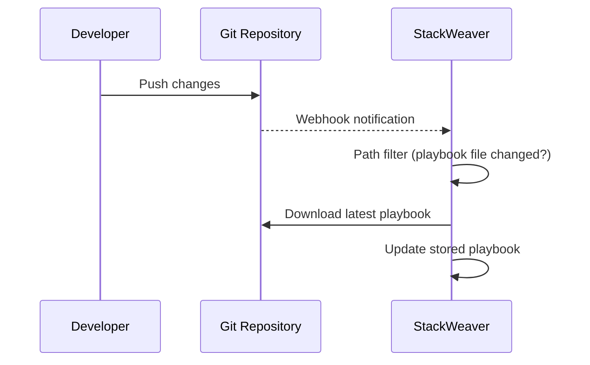

# Ansible Playbook Webhook Sync

StackWeaver automatically synchronizes Ansible playbooks from your Git repositories whenever you push changes. Keep your playbooks in version control and let StackWeaver handle the rest.

## Overview

Instead of manually uploading playbook files, you can connect your playbooks to a Git repository. StackWeaver monitors your repository and automatically syncs playbook files when changes are pushed, ensuring your playbooks are always up to date with your codebase.

## How It Works

<strong>Flow Steps (Legend)</strong>

1. **Connect** - Link your playbook to a Git repository and specify the branch and file path.
2. **Push** - When you push changes to the repository, StackWeaver detects the push via webhook.
3. **Filter** - Sync only triggers when the specific playbook file (or related files) change.
4. **Update** - StackWeaver downloads the latest version and updates the playbook automatically.

## Setting Up VCS Sync

To enable automatic playbook synchronization:

1. **Create or Edit Playbook**: When creating a playbook, or when editing an existing one
2. **Select VCS Connection**: Choose a configured GitHub App connection
3. **Specify Repository**: Enter the repository name (e.g., `myorg/ansible-playbooks`)
4. **Set Branch**: Choose which Git branch to sync from (default: `main`)
5. **Configure Playbook Path**: Specify the path to your playbook file within the repository (e.g., `playbooks/deploy.yml`)

Once configured, StackWeaver automatically syncs the playbook whenever changes are pushed to that branch.

## Path-Based Filtering

StackWeaver intelligently filters sync operations based on which files changed:

- **Playbook File Changes**: Sync triggers when the playbook file itself is modified
- **Related File Changes**: Sync also triggers for common Ansible files like `requirements.yml` or related playbooks
- **Unrelated Changes Ignored**: Changes to other files in the repository don't trigger unnecessary syncs

This prevents unnecessary syncs while ensuring your playbooks update when they need to.

## Manual Sync

You can also manually trigger a sync at any time:

1. Open the playbook detail page
2. Click "Sync" to immediately pull the latest version from the repository

Manual syncs are useful when:
- You want to update before the next push
- Testing sync configuration
- Recovering from a failed automatic sync

## Sync Status

Each playbook shows sync status information:

- **Last Sync Time**: When the playbook was last successfully synced
- **Sync Status**: Success or failure of the last sync operation
- **Commit Hash**: The Git commit SHA of the synced version
- **Sync Errors**: Any errors encountered during sync (repository access, file not found, etc.)

This helps you verify that your playbooks are staying in sync with your repository.

## Benefits

- **Version Control Integration**: Keep playbooks in Git with the rest of your infrastructure code
- **Automatic Updates**: No manual uploads needed when you make changes
- **Consistency**: All team members work from the same version in Git
- **History**: Git provides full history and change tracking
- **CI/CD Integration**: Combine with other automation for complete workflow integration

## Use Cases

Common scenarios for VCS-synced playbooks:

- **Infrastructure as Code**: Store playbooks alongside Terraform configurations in the same repository
- **Environment-Specific Playbooks**: Different branches for dev, staging, and production environments
- **Shared Playbooks**: Multiple projects can reference the same playbook from a shared repository
- **Automated Deployment**: Combine webhook sync with job templates for fully automated workflows

## Troubleshooting

If sync fails, check:

- **VCS Connection**: Ensure the GitHub App connection is properly configured
- **Repository Access**: Verify the connection has access to the repository
- **Branch Name**: Confirm the branch exists in the repository
- **File Path**: Ensure the playbook path is correct relative to the repository root
- **Webhook Configuration**: Check that webhooks are properly configured in GitHub

Sync errors are displayed in the playbook detail view, along with details about what went wrong.

## Related Documentation

- [Ansible Documentation](./ansible/README.md) - Complete Ansible integration guide
- [GitHub App Setup](../user-guides/vcs/github-app.md) - Setting up VCS connections
- [VCS Path Filtering](./opentofu/vcs-path-filtering.md) - How path-based filtering works for Terraform workspaces
