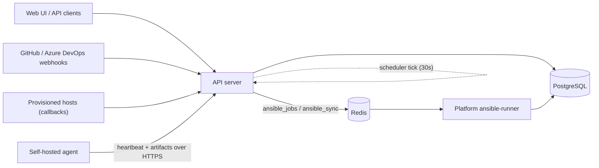
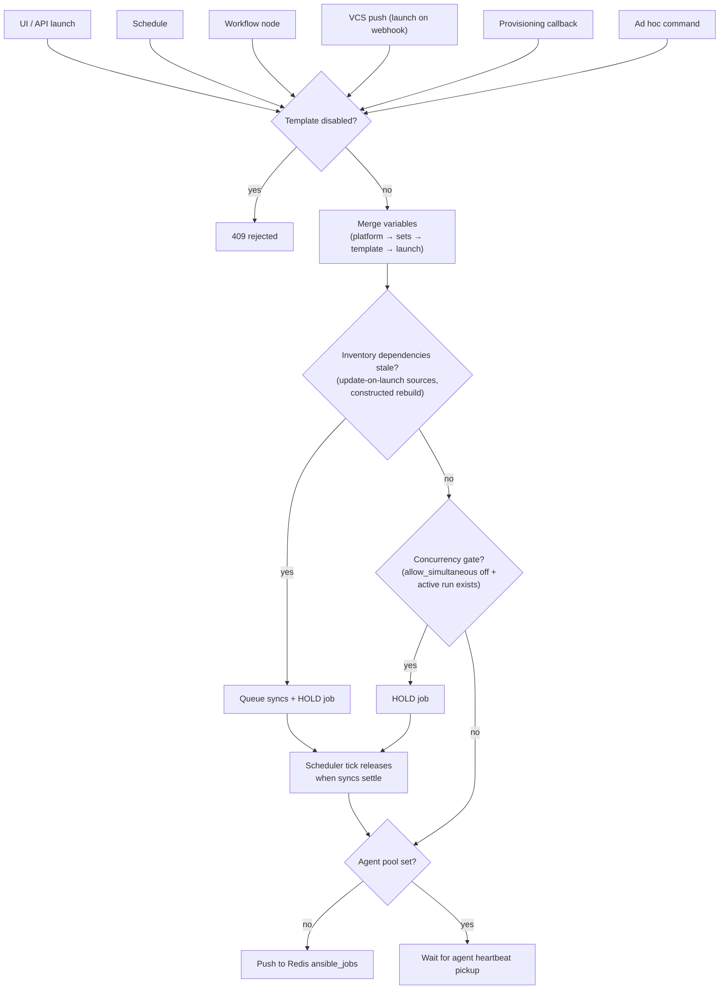
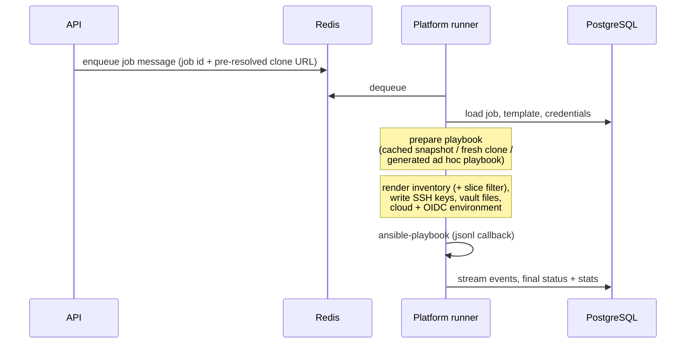
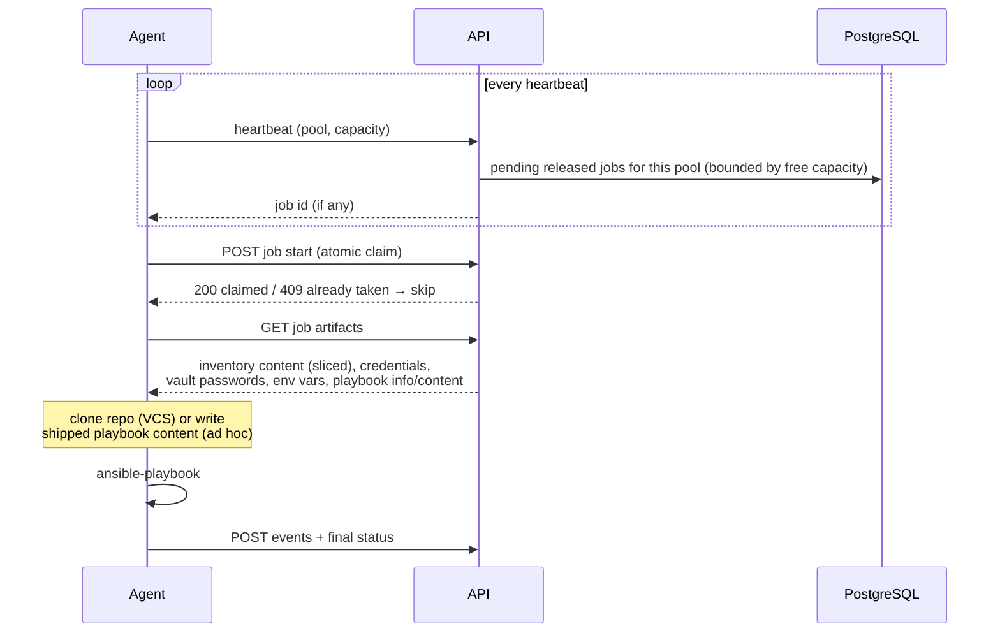
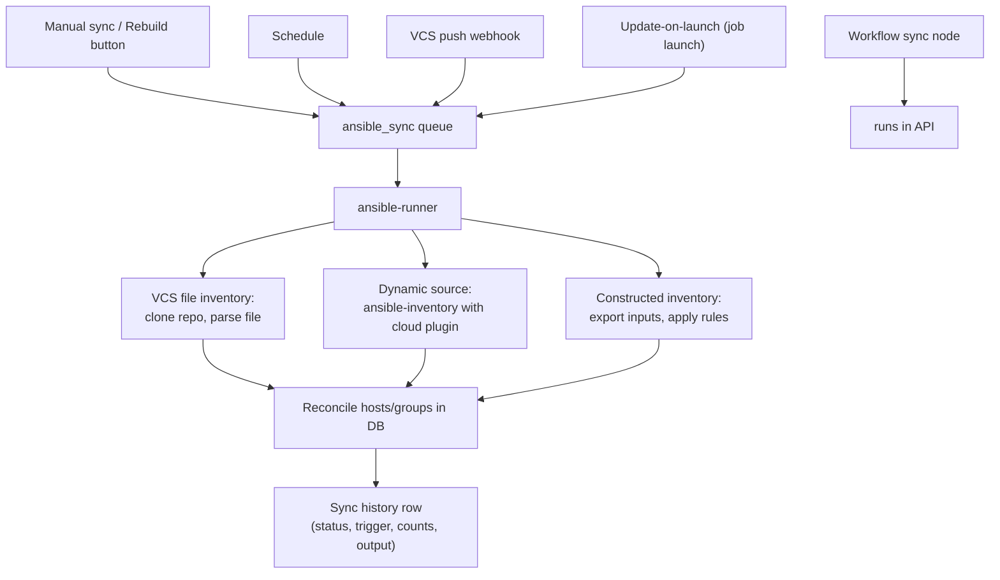
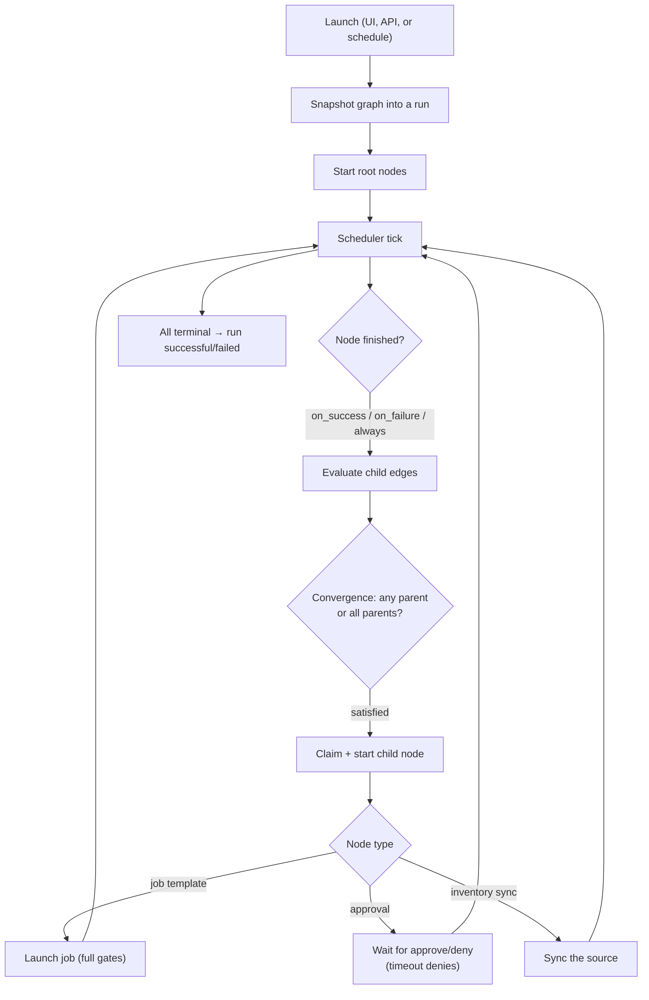
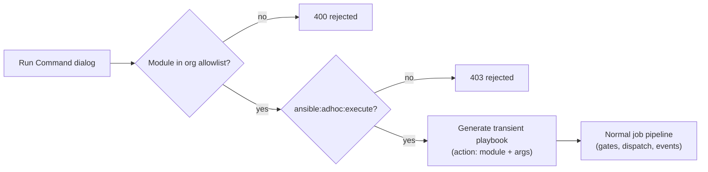
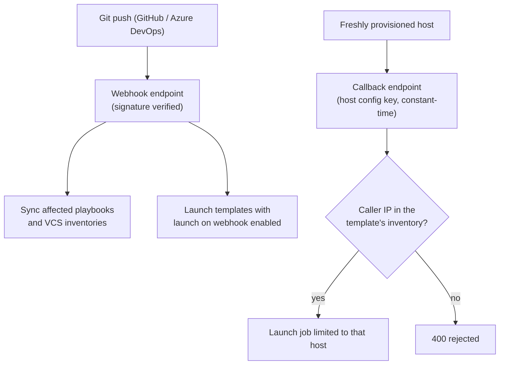

# Execution Flows

This page explains how Ansible work actually moves through Stackweaver: what happens between clicking Launch and seeing output, how the platform runner differs from a self-hosted agent, how inventory syncs flow, and how workflows, ad hoc commands, and webhooks fit in. Each section has a diagram of the flow it describes.

## The Big Picture

Stackweaver's Ansible engine is built from a small number of cooperating services. The API owns all state and decisions; runners only execute. Two Redis lists connect them: `ansible_jobs` carries playbook runs and `ansible_sync` carries inventory and playbook syncs. Self-hosted agents do not use Redis at all — they poll the API over HTTPS.

<strong>Components (Legend)</strong>

1. **API server** — owns every decision: launch gates, RBAC, variable merging, workflow progression, notification dispatch. Runs the scheduler tick.
2. **PostgreSQL** — jobs, events, inventories, sync history, workflow state. The platform runner reads and writes it directly; agents never touch it.
3. **Redis** — two queues only: `ansible_jobs` (playbook runs) and `ansible_sync` (inventory/playbook syncs). Used exclusively by the platform runner.
4. **Platform ansible-runner** — Stackweaver's own runner container. Dequeues from Redis, executes, writes events straight to the database.
5. **Self-hosted agent** — the same runner binary in agent mode, running in your network. Outbound-only HTTPS: it heartbeats, picks up jobs assigned to its agent pool, downloads everything it needs as one artifacts bundle, and posts results back.
6. **Scheduler tick** — a 30-second loop inside the API that runs schedules, releases held jobs, advances workflows, dispatches notifications, and cleans up expired jobs.

## Job Lifecycle and Launch Gates

Every launch path converges on the same job service, and every job passes the same gates before it is allowed to run. A job that fails a gate is not rejected — it is created **held** (no dispatch timestamp) and the scheduler releases it automatically once the blocking condition clears.

<strong>Gate details (Legend)</strong>

1. **Disabled gate** — a disabled template refuses every launch path with 409, including schedules and callbacks.
2. **Variable merge** — platform variables, then variable sets, then template variables, then launch-time overrides; later layers win.
3. **Dependency gate** — inventory sources with *update on launch* whose cache window lapsed are synced first; constructed inventories rebuild from their inputs. The job stays held until no dependency sync is running (a sync stuck longer than 30 minutes stops blocking).
4. **Concurrency gate** — without *allow simultaneous*, one run per template at a time; the check-then-create runs under a per-template database lock so concurrent launches cannot both pass. Sliced jobs skip this gate by design.
5. **Release** — the scheduler tick re-evaluates held jobs every 30 seconds and dispatches the ones whose gates cleared.

Job slicing happens at launch: a template with a slice count above one fans out into N jobs, each receiving a deterministic subset of the inventory's hosts (sorted, distributed round-robin). Slices run simultaneously and are grouped under one slice group.

## Platform Runner vs Self-Hosted Agent

Both paths run the same playbook with the same options — the difference is **how the work and its inputs reach the executor**. The platform runner is push-based and trusted with database access; the agent is pull-based and receives everything as a self-contained bundle, so it works from inside a private network with outbound-only connectivity and no credentials for Stackweaver's infrastructure.

| | Platform runner | Self-hosted agent |
|---|---|---|
| Transport | Redis queue (`ansible_jobs`) | Outbound HTTPS polling (heartbeat) |
| Job assignment | Any platform runner takes the next queued job | Only jobs whose template targets the agent's pool, offered up to the agent's free capacity and claimed atomically on start so exactly one agent runs each job (or slice) |
| Inputs | Reads playbook/inventory/credentials from the database and object storage itself | Downloads one artifacts bundle: rendered inventory, decrypted credentials and vault passwords, cloud auth environment, playbook (VCS clone info, or generated content for ad hoc) |
| Results | Writes job events and status directly to the database | Posts events and status back over HTTPS |
| Network position | Inside the Stackweaver deployment | Anywhere with outbound HTTPS to the API |

### Platform runner flow

### Self-hosted agent flow

<strong>Why the difference matters (Legend)</strong>

1. **Held jobs apply to both** — agents only see jobs that the gates have released, so concurrency limits and dependency syncs behave identically.
2. **Credentials never rest on the agent** — they arrive decrypted in the artifacts response, are written to files for the duration of the run, and the workspace is cleaned afterwards.
3. **Ad hoc on agents** — the transient playbook is generated server-side and shipped as content in the artifacts bundle, so no repository access is needed.
4. **One agent per job** — when several agents share a pool, the API only offers an agent as many jobs as it has free capacity, and the start call claims the job atomically. A second agent that was offered the same job loses the race and skips it, so a job (or a slice) never runs twice.
5. **Choosing the path** — set an agent pool on the job template (or pick a runner in the Run Command dialog); leave it empty to run on platform runners.

## Inventory Sync Flows

Every way an inventory can refresh goes through the same queue and lands in the same sync history (the Syncs tab), each run with its captured output. Long syncs can be tailed live: the runner flushes output to the run's history row every couple of seconds while it executes, and the output dialog polls while a run is active.

<strong>Reconciliation semantics (Legend)</strong>

1. **Source ownership** — dynamic sources stamp the hosts and groups they discover. With *overwrite* on, a source prunes only its own rows when the provider stops reporting them; manual entries and other sources' rows are never touched.
2. **Variable merging** — by default synced host variables merge into existing ones (your manual keys survive); *overwrite variables* switches to wholesale replacement.
3. **Constructed inventories** — wholly own their derived hosts and groups: every rebuild replaces the materialized set from the inputs and rules.
4. **History and live tail** — each run records who triggered it (manual, schedule, launch, workflow, webhook), host/group counts, duration, and the full diagnostics; raise the source's verbosity for more detail.

## Workflow Execution

Launching a workflow snapshots its graph and creates a run; from there the scheduler tick advances execution. Nodes start when their parents finish with a matching edge condition, approval nodes pause the run until a human decides, and the run rolls up once no node can advance.

<strong>Engine guarantees (Legend)</strong>

1. **Snapshot** — edits to the workflow after launch never affect a running run.
2. **Single start** — nodes are claimed atomically, so a tick racing an approval click cannot start the same node twice.
3. **Skipped paths** — when an edge condition is not met, the unreachable subtree is marked skipped rather than left dangling.
4. **Approvals** — pending approvals surface in the run dialog with Approve/Deny; an optional timeout auto-denies.

## Ad Hoc Commands

Run Command executes a single module against an inventory without a playbook or template. The platform generates a one-task playbook from the module and arguments and pushes it through the normal job pipeline, so ad hoc runs get live output, events, and statistics like any job — on a platform runner or any agent pool.

The allowed modules are an organization setting (Settings → Ansible), defaulting to AWX's list, and the permission is distinct from template execution so you can grant ad hoc access separately.

## Webhook Triggers

Two unauthenticated-by-design entry points exist, both validated by their own secret:

For *launch on webhook*, pair the template's playbook with the `fresh` source mode so the job always runs the pushed commit; in `cached` mode a launch can race the snapshot sync and run the previous commit. Provisioning callbacks require the template to allow callbacks and the calling host to already exist in the template's inventory.

## The Scheduler Tick

A single 30-second loop in the API drives everything time-based. Knowing what it owns explains most "why did this happen a few seconds later" questions:

1. **Schedules** — due cron schedules launch their job template, inventory source sync, playbook sync, or workflow.
2. **Held-job release** — re-evaluates jobs held by the concurrency or dependency gates and dispatches the ones whose conditions cleared.
3. **Workflow progression** — advances running workflow runs node by node.
4. **Notification dispatch** — polls for unnotified job and workflow state transitions and delivers webhook, email, and Microsoft Teams notifications (crash-safe: a restart never loses or duplicates a notification).
5. **Retention cleanup** — once a day, deletes finished jobs older than the organization's retention window (template overrides apply; each template's most recent job is always kept).
