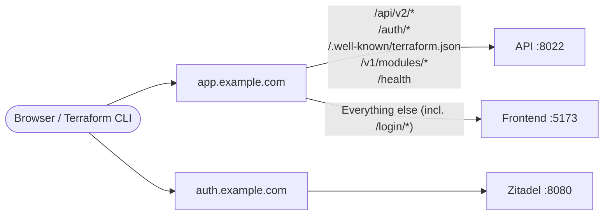

# Docker Compose Deployment

This guide walks through deploying StackWeaver using Docker Compose on a single machine.
This is the quickest way to get started for evaluation or small-scale production use.
No source code is required; all services use pre-built container images from GHCR.

## Prerequisites

You need the following installed on your host machine.

- Docker Engine 24+ with Docker Compose v2
- At least 4 GB of free RAM (8 GB recommended)
- Ports 5173 (frontend), 8022 (API), 8080 (Zitadel), and 3000 (Login UI) available

## Example Files

The complete Docker Compose setup is shown below. Download or copy these files into a directory on your host.

::: code-explorer ./example
:::

## Quick Start

Copy the example files into a directory and start all services.

```bash
cp .env.example .env
docker compose up -d
```

This starts all services (PostgreSQL, Redis, Garage, Zitadel, the API, frontend, orchestrator, runners) using Docker Compose with `network_mode: host`.
The first run takes a few minutes while Zitadel initialises and the `zitadel-init` container generates credentials.

You can follow the init progress with the following command.

```bash
docker compose logs -f zitadel-init
```

Once `zitadel-init` has completed and all services are running, open `http://localhost:5173` in your browser.
The default Zitadel admin credentials are `admin@ZITADEL.localhost` / `Password1!`.

## Architecture

All services run on the host network (`network_mode: host`), so they communicate via `localhost` on their respective ports.

| Service | Port | Description |
|---|---|---|
| Frontend | 5173 | React SPA (nginx) |
| API | 8022 | Go REST API |
| Zitadel | 8080 | OIDC identity provider |
| Login UI | 3000 | Zitadel login interface |
| PostgreSQL | 5432 | Database |
| Redis | 6379 | Job queue and pubsub |
| Garage | 3900 | S3-compatible object storage (state, configs, registry) |

The orchestrator, Terraform runner, and Ansible runner do not expose ports. They communicate via the Redis queue and PostgreSQL.

## Service Management

```bash
docker compose up -d                # Start all services
docker compose down                 # Stop all services (preserves data)
docker compose down -v              # Stop and remove volumes (destroys data)
docker compose pull                 # Pull latest images
docker compose up -d --pull always  # Update to latest and restart
```

View logs for a specific service.

```bash
docker compose logs api           # API logs
docker compose logs orchestrator  # Orchestrator logs
docker compose logs runner        # Runner logs
docker compose logs zitadel       # Zitadel logs
docker compose logs zitadel-init  # Init logs (credentials)
```

## Configuration

### Environment Files

StackWeaver uses several environment files. Most credentials are auto-generated by the `zitadel-init` container on first startup.

| File | Purpose | How to edit |
|---|---|---|
| `.env` | Main config + auto-generated Zitadel credentials | Copy from `.env.example`, edit the top section; bottom section is auto-generated by `zitadel-init` |
| `sso.env` | SSO / external IdP credentials (optional) | Edit with your SSO provider values |
| `vcs.env` | VCS provider OAuth credentials (optional) | Edit with your VCS provider values |
| `oidc.env` | OIDC workload identity signing key (optional) | Edit with your OIDC key and issuer |

For a full list of every environment variable, see the [Environment Variables Reference](../environment-variables.md).

### GitHub App Integration

The GitHub App integration is optional and disabled by default. To enable it, uncomment the GitHub-related environment variables and volume mounts in `docker-compose.yml` for the `api` and `orchestrator` services. Place your GitHub App private key file in the same directory as `docker-compose.yml`.

See the [VCS guides](../../../user-guides/vcs/) for detailed setup instructions.

### Custom Domain (Production)

By default StackWeaver runs on `localhost`. To use a custom domain, update the following.

1. Edit `zitadel-defaults.yaml` and set the `ExternalDomain`, `ExternalPort`, and `ExternalSecure` fields.
2. Set the `ZITADEL_CUSTOM_DOMAINS` environment variable in `.env`.
3. Update the frontend env vars (`VITE_API_URL`, `VITE_ZITADEL_REDIRECT_URI`) in `.env`.
4. Update `zitadel-init.yaml` with custom domain and redirect URIs.
5. Restart all services: `docker compose down && docker compose up -d`.

See the [Zitadel Setup guide](../../../user-guides/authentication/zitadel-setup.md) for detailed instructions.

### Reverse Proxy

For production deployments behind a reverse proxy (nginx, Caddy, Cloudflare Tunnel), you need to route two domains.



**App domain** (e.g. `app.example.com`):
- `/api/v2/*`, `/auth/*`, `/.well-known/terraform.json`, `/v1/modules/*`, `/health` → `localhost:8022`
- Everything else (including the SPA's `/login/*` login pages) → `localhost:5173`

**Auth domain** (e.g. `auth.example.com`):
- All traffic → `localhost:8080`. The standalone Zitadel-hosted login UI on port 3000 was removed at cutover — Stackweaver now serves login via its own SPA pages under the app domain's `/login/*`, with `/auth/*` on the app domain proxying Zitadel's session + OIDC APIs.

## Data Persistence

Docker Compose uses named volumes for persistent data.

| Volume | Data | Critical? |
|---|---|---|
| `postgres_data` | Database (all application state) | Yes; back up regularly |
| `garage_data` | Object storage (Terraform state, configs, registry) | Yes; back up regularly |
| `runner-workspaces` | Temporary workspace files | No; recreated on runs |
| `zitadel-pat` | Zitadel admin PAT (shared with init job) | No; regenerated on init |

To back up PostgreSQL, use `pg_dump`.

```bash
docker exec postgres pg_dump -U iac iac_platform > backup.sql
```

## Upgrading

Pull the latest images and restart.

```bash
docker compose pull
docker compose up -d
```

The API auto-migrates the database schema on startup via GORM, so no manual migration step is needed.
If a release includes breaking changes, the release notes will contain specific upgrade instructions.

## Troubleshooting

**Services fail to start**: Check that all required ports are free. `ss -tlnp | grep -E '5173|8022|8080|5432|6379|3900'` shows any conflicts.

**Zitadel init fails**: The `zitadel-init` container needs Zitadel to be fully ready. Check `docker compose logs zitadel-init` and restart it with `docker compose restart zitadel-init`.

**API can't connect to database**: Ensure PostgreSQL is healthy. `docker compose ps postgres` should show `healthy`. Check that the database credentials in `.env` match the PostgreSQL container environment.

**Frontend shows blank page**: Check browser console for CORS errors. Ensure `VITE_API_URL` is set correctly in `.env`. The frontend generates `env.js` at container startup from environment variables, so a restart is sufficient after changes (`docker compose restart frontend`).

## Development Setup

If you want to build StackWeaver from source for development or contribution, you need to contact us directly, due to the current nature of open source we have opted for a source available approach. If you are a talented developer and your interested in contributing to stackweaver feel free to reach us at `contact@vhco.pro`.
