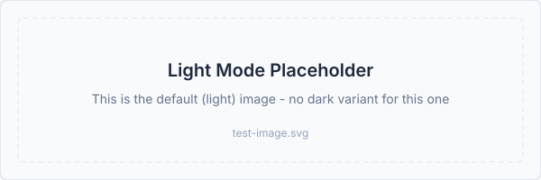
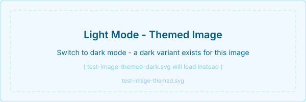
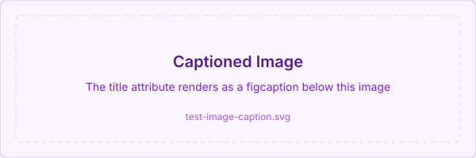

# Image Support Test Page

This page tests every image feature implemented in the docs viewer: relative path resolution, GitHub-style presentation, captions, dark-mode variants, and the click-to-zoom lightbox.

## 1. Basic Relative Image

The image below uses a `./` relative path. The viewer resolves it to `/docs/test-image.svg` at runtime. It has no dark variant; the same file is shown in both light and dark mode.

```markdown

```


> [!TIP]
> Click the image to open it in the lightbox (full-size modal). Press Escape or click outside to dismiss. Keyboard users can focus the image and press Enter or Space.

## 2. Dark-Mode Variant

The image below has a paired dark variant. When you switch the theme to dark, `test-image-themed-dark.svg` loads automatically. Switch back to light and it returns to the blue version. No markdown change needed; just follow the file naming convention `filename-dark.ext`.

```markdown

```


The two files involved:

| Theme | File loaded |
|---|---|
| Light | `test-image-themed.svg` |
| Dark | `test-image-themed-dark.svg` |

> [!NOTE]
> If the dark variant file does not exist, the viewer falls back silently to the light image with no broken-image icon. The `onError` handler sets an internal `darkFailed` flag that switches `activeSrc` back to the base image.

## 3. Caption via Title Attribute

Adding a title string to the markdown image syntax wraps the image in a `<figure>` with a `<figcaption>`. The caption appears centred below the image in small muted text.

```markdown

```


The click-to-zoom handler is on the `` inside the `<figure>`, not on the figure itself.

## 4. Lightbox (Click to Zoom)

Every image in the docs viewer is clickable. Clicking opens a full-viewport `Dialog` showing the image at up to 90 vw / 90 vh. The lightbox is managed by a single `lightboxSrc` state at the `MarkdownRenderer` level; all three images above share the same lightbox.

Features:
- Close with Escape key (shadcn/ui Dialog)
- Close by clicking the backdrop or the X button
- Keyboard accessible: Tab to image, Enter or Space to open

## 5. Path Resolution Rules

The `DocImage` component resolves paths using the same logic as the internal link handler:

| Markdown source | Current page | Resolved URL |
|---|---|---|
| `./image.png` | `features/terraform/run-timeout.md` | `/docs/features/terraform/image.png` |
| `../shared.svg` | `features/terraform/run-timeout.md` | `/docs/features/shared.svg` |
| `image.png` (bare) | `features/README.md` (directory page) | `/docs/features/image.png` |
| `https://example.com/img.png` | any | passed through unchanged |
| `/docs/images/logo.svg` | any | passed through unchanged |

## 6. Build Script Behaviour

Running `npm run build:docs` (or `node scripts/build-docs-index.js`) now:

1. Scans `docs/` for both `.md` files and image files (`.png`, `.jpg`, `.jpeg`, `.gif`, `.svg`, `.webp`, `.avif`)
2. Copies all files to `frontend/public/docs/` in one pass (single `copyFiles` call to avoid the double-delete bug)
3. Losslessly optimises images via `svgo` (SVG) and `sharp` (PNG, JPEG)
4. Caches optimised images in `frontend/.docs-image-cache/`; unchanged images are not re-optimised on the next build
5. Only `.md` files are indexed in the navigation tree; image files do not appear in the sidebar
6. Images under `docs/internal/` are excluded (same rule as markdown files)
