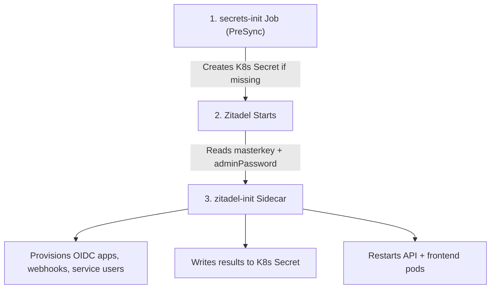
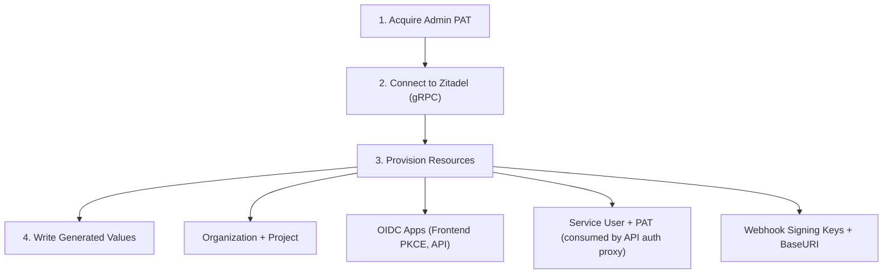

# Zitadel Setup Guide

This guide covers how Zitadel is configured and initialized in StackWeaver, for both the Kubernetes (Helm) and Docker Compose deployment paths.

> **References:**
> - [Zitadel defaults.yaml](https://github.com/zitadel/zitadel/blob/main/cmd/defaults.yaml)
> - [Zitadel setup steps.yaml](https://github.com/zitadel/zitadel/blob/main/cmd/setup/steps.yaml)
> - [Zitadel production guide](https://zitadel.com/docs/self-hosting/manage/production)

## Overview

Zitadel provides OIDC/OAuth 2.0 authentication for StackWeaver, including:

- OpenID Connect and OAuth 2.0 flows (PKCE for the frontend, client credentials for the API)
- Multi-factor and passwordless authentication
- User management and roles
- Login V2: a custom login UI bundled into the Stackweaver SPA (`/login/*` routes), backed by an auth proxy in the API container that handles all Zitadel session API + OIDC endpoint calls. The standalone `ghcr.io/zitadel/zitadel-login` container is no longer used.

StackWeaver ships a `zitadel-init` bootstrap container that automatically provisions all required OIDC apps, service users, and webhooks after Zitadel starts.
No manual Zitadel console steps are required.

## Kubernetes / Helm Deployment

### What the Chart Does Automatically

When you install the Helm chart, the following happens without any manual intervention:



<details>
<summary><strong>Flow Steps (Legend)</strong></summary>

1. **Secrets init (PreSync Job)** - A `secrets-init` Job runs before the rest of the chart. It creates the Zitadel Kubernetes Secret (containing a randomly generated 32-character `masterkey` and an `adminPassword`) only if the secret does not already exist. This is idempotent - re-syncing never overwrites existing credentials.

2. **Zitadel starts** - The Zitadel pod waits for PostgreSQL to be ready (via an initContainer), then runs `start-from-init`. It reads `masterkey` and `adminPassword` from the Kubernetes Secret via environment variables.

3. **zitadel-init sidecar** - A sidecar container in the same pod as Zitadel waits for Zitadel to become ready, then provisions the OIDC apps (frontend, API), registers the production redirect URI, sets the Login V2 BaseURI to the Stackweaver SPA's `/login` path via the Feature API, configures the login service user (whose PAT is consumed by the API container's auth proxy + TOTP service + Zitadel webhook handler), and webhook keys, then writes the results directly into the Zitadel Kubernetes Secret. It also triggers rolling restarts of the API + frontend pods, then enters an idle state with a health endpoint on `:8081`.

</details>

**PAT acquisition**: On the first boot (fresh database), Zitadel writes an admin PAT to a shared emptyDir volume. The sidecar reads this file and persists the PAT into the K8s Secret (`admin-pat` key). On subsequent pod restarts, the emptyDir is empty (Zitadel skips PAT generation for existing databases), so the sidecar falls back to reading the PAT from the K8s Secret. This three-tier fallback (`ZITADEL_PAT` env var > PAT file > K8s Secret) ensures the sidecar never crash-loops on pod restarts.

### Accessing the Zitadel Admin Console (Kubernetes)

The Zitadel console is available at `https://<ingress.hosts.auth>/ui/console`.

**Admin credentials:**

In Zitadel, login names follow the format `username@orgname.externaldomain`.
When `ExternalDomain` is your auth hostname (e.g. `sw-auth.example.com`), the admin login name becomes:

```
admin@zitadel.<ingress.hosts.auth>
# example: admin@zitadel.sw-auth.example.com
```

The email address (`admin@ZITADEL.localhost`, configured via `zitadel.init.adminUsername`) also works as a login identifier.

The password is auto-generated on first install. Retrieve it with:

```bash
kubectl get secret stackweaver-zitadel -n stackweaver \
  -o jsonpath='{.data.admin-password}' | base64 -d
```

> **Note:** In Docker Compose, `ExternalDomain` is `localhost`, so the login name is `admin@ZITADEL.localhost` with the static password `Password1!`. These differ from Kubernetes by design.

### Troubleshooting: Admin Password Does Not Work (Kubernetes)

The admin password is written to the Kubernetes Secret by the PreSync `secrets-init` job and injected into Zitadel via `ZITADEL_FIRSTINSTANCE_ORG_HUMAN_PASSWORD`. This only takes effect during the **first** Zitadel initialization - if the database already existed with a different password (e.g. the secret was deleted and recreated), the DB and secret are out of sync.

To recover, reset the Zitadel database and let it reinitialize:

```bash
PG_POD=$(kubectl get pod -n stackweaver \
  -l app.kubernetes.io/component=postgresql \
  -o jsonpath='{.items[0].metadata.name}')

kubectl exec -n stackweaver "$PG_POD" -- \
  psql -U iac -c "DROP DATABASE IF EXISTS zitadel;"

kubectl exec -n stackweaver "$PG_POD" -- \
  psql -U iac -c "CREATE DATABASE zitadel OWNER iac;"

kubectl rollout restart deployment/stackweaver-zitadel -n stackweaver
```

After Zitadel restarts and completes initialization, the new password from the secret will be active.

### Monitoring Initialization Progress

```bash
# Watch the zitadel-init sidecar logs
kubectl logs -f deployment/stackweaver-zitadel -c zitadel-init -n stackweaver

# Check Zitadel pod status
kubectl get pod -n stackweaver -l app.kubernetes.io/component=zitadel
```

### Troubleshooting: zitadel-init Crash-Looping (PAT Not Found)

If the `zitadel-init` sidecar is crash-looping with errors about the PAT file not being found, this means:

1. The database already exists (Zitadel skips `FirstInstance`, so no PAT file is written to emptyDir).
2. The K8s Secret does not contain an `admin-pat` value (e.g., the secret was manually recreated without it).

**To fix**, force a clean first-time initialization:

```bash
# Option A: Reset the Zitadel database (preserves other data)
PG_POD=$(kubectl get pod -n stackweaver \
  -l app.kubernetes.io/component=postgresql \
  -o jsonpath='{.items[0].metadata.name}')

kubectl exec -n stackweaver "$PG_POD" -- \
  psql -U iac -c "DROP DATABASE IF EXISTS zitadel;"

kubectl exec -n stackweaver "$PG_POD" -- \
  psql -U iac -c "CREATE DATABASE zitadel OWNER iac;"

# Delete the Zitadel secret so it gets recreated with empty admin-pat
kubectl delete secret stackweaver-zitadel -n stackweaver

# Restart Zitadel to trigger a fresh FirstInstance
kubectl rollout restart deployment/stackweaver-zitadel -n stackweaver
```

After Zitadel reinitializes, the sidecar will read the PAT from the emptyDir and persist it to the K8s Secret. Future pod restarts will use the secret fallback.

### Troubleshooting: Stuck Migration Lock

If Zitadel fails with `migration already started` or `migration failed err.id=MIGR-*`, a previous run left a partially completed migration lock in the database.
This typically happens after a crash during first initialization.

To clear it, drop and recreate the `zitadel` database:

```bash
PG_POD=$(kubectl get pod -n stackweaver \
  -l app.kubernetes.io/component=postgresql \
  -o jsonpath='{.items[0].metadata.name}')

kubectl exec -n stackweaver "$PG_POD" -- \
  psql -U iac -c "DROP DATABASE IF EXISTS zitadel;"

kubectl exec -n stackweaver "$PG_POD" -- \
  psql -U iac -c "CREATE DATABASE zitadel OWNER iac;"
```

Then restart the Zitadel pod:

```bash
kubectl rollout restart deployment/stackweaver-zitadel -n stackweaver
```

### Troubleshooting: Zitadel Panics with "no private ip address"

If Zitadel panics with:

```
none of the enabled methods for identifying the machine succeeded
failed to get Private IP address no private ip address
```

This means Zitadel's Sonyflake ID generator cannot identify the machine.
In Kubernetes each pod runs in its own network namespace, so the private IP scan returns nothing.
The fix is already applied in the Helm chart (`Machine.Identification.Hostname.Enabled: true`).
If you see this on an older install, upgrade the chart and resync.

### Troubleshooting: Zitadel Not Starting

```bash
# Check Zitadel pod logs
kubectl logs -n stackweaver \
  $(kubectl get pod -n stackweaver -l app.kubernetes.io/component=zitadel -o jsonpath='{.items[0].metadata.name}')

# Check if PostgreSQL is ready
kubectl get pod -n stackweaver -l app.kubernetes.io/component=postgresql
```

### Troubleshooting: OAuth Redirects to Internal Service URL

If the browser is redirected to a URL like `http://stackweaver-frontend:5173/login/...` (an internal Kubernetes DNS name) instead of `https://<your-app-host>/login/...`, the Login V2 BaseURI in Zitadel's database is pointing at the internal service instead of the public app domain.

This is already fixed: `zitadel-init` calls the Zitadel Feature API (`SetInstanceFeatures`) on every run to set `LoginV2.BaseUri` to `https://<ingress.hosts.app>/login` (the Stackweaver SPA's `/login` routes).
The Feature API update runs after every ArgoCD sync, so changing `ingress.hosts.app` in `values.yaml` and resyncing is enough to fix it.

If you need to verify what BaseURI is currently active:

```bash
# Check the LOGIN_UI_BASE_URL passed to the init job
kubectl describe job stackweaver-zitadel-init -n stackweaver | grep LOGIN_UI_BASE_URL

# Or check the zitadel-init job logs for the confirmation line
kubectl logs job/stackweaver-zitadel-init -n stackweaver | grep "Login V2 BaseURI"
```

---

## Docker Compose Deployment

### Quick Start (Automated Bootstrap)

The Docker Compose stack ships with a Go bootstrap (`scripts/zitadel-init/main.go`) that provisions all required OIDC apps automatically.

```bash
# 1. Start the stack (Zitadel will initialize automatically)
cd deploy
docker compose up -d --build

# 2. Run the initializer once (after Zitadel is up)
docker compose run --rm zitadel-init

# 3. Restart so services pick up the generated env files
docker compose up -d
```

> **Linux tip:** use `network_mode: host` so every container dials `localhost` directly.
> This is already the default in `deploy/docker-compose.yml`.

### Admin Credentials (Docker Compose)

The Docker Compose stack uses static credentials defined in `deploy/zitadel-init-steps.yaml`:

| Field | Value |
|---|---|
| Username | `admin@ZITADEL.localhost` |
| Password | `Password1!` |
| Console URL | `http://localhost:8080/ui/console` |

### What `zitadel-init` Does



<details>
<summary><strong>Flow Steps (Legend)</strong></summary>

1. **Acquire admin PAT** - **Docker Compose**: waits up to 300s for `/pat/admin.pat` (written by Zitadel during `start-from-init`). **Kubernetes (first boot)**: waits for readiness, reads PAT from emptyDir, persists to K8s Secret. **Kubernetes (pod restart)**: falls back to `admin-pat` from K8s Secret. **Manual override**: `ZITADEL_PAT` env var takes highest priority.
2. **Connect** - Uses the PAT to connect to Zitadel via gRPC (`localhost:8080`).
3. **Provision** - Creates or updates: Organization `IAC Platform`, Project, Frontend OIDC app (PKCE) with production redirect URI, API app (client secret), service-account machine user + PAT (`IAM_LOGIN_CLIENT` role - consumed post-cutover by the API container's auth proxy + TOTP service + Zitadel webhook handler; the user retains its historical `login-ui-service` name to avoid breaking live deployments), webhook signing keys, and Login V2 BaseURI (via Feature API).
4. **Write** - Writes the generated values to `deploy/.env`.

</details>

The bootstrap is idempotent - re-running it reuses existing apps and orgs.

The bootstrap is idempotent - re-running it reuses existing apps and orgs.

### Environment Variables Written to `deploy/.env`

```env
ZITADEL_FRONTEND_CLIENT_ID=<frontend-client-id>
ZITADEL_API_CLIENT_ID=<api-client-id>
ZITADEL_API_CLIENT_SECRET=<api-client-secret>
ZITADEL_LOGIN_SERVICE_USER_TOKEN=<login-service-user-pat>
ZITADEL_LOGIN_SERVICE_USER_ID=<login-service-user-id>
ZITADEL_WEBHOOK_IDP_SYNC_KEY=<webhook-key>
ZITADEL_WEBHOOK_COMPLEMENT_TOKEN_KEY=<webhook-key>
```

> **Important:** `deploy/.env` is auto-generated and will be overwritten on each `zitadel-init` run.
> Persistent configuration lives in `deploy/sso.env`, `deploy/vcs.env`, and `deploy/oidc.env`.
> Never put values directly in `deploy/.env`.

### Environment Variable Reference for `zitadel-init`

| Variable | Description | Default |
|---|---|---|
| `ZITADEL_ISSUER` | Public issuer written to `.env` | `http://localhost:8080` |
| `ZITADEL_INTERNAL_ADDR` | Host:port the initializer dials | `localhost:8080` |
| `ZITADEL_ADMIN_USERNAME` | Admin username (matches init-steps.yaml) | `admin@ZITADEL.localhost` |
| `ZITADEL_ADMIN_PASSWORD` | Admin password (matches init-steps.yaml) | `Password1!` |
| `PROJECT_ROOT` | Where env/config files are written | `/config` inside container |
| `ZITADEL_PAT` | Optional PAT override instead of `/pat/admin.pat` | empty |
| `FRONTEND_REDIRECT_URI` | OAuth redirect URI registered on the frontend OIDC app | empty (Kubernetes only) |
| `FRONTEND_POST_LOGOUT_URI` | Post-logout redirect URI registered on the frontend OIDC app | empty (Kubernetes only) |
| `LOGIN_UI_BASE_URL` | Login V2 BaseURI set via Feature API (overrides database value) - points at the Stackweaver SPA's `/login` route. Variable name is historical; despite "LOGIN_UI" the value is the SPA URL | empty (Kubernetes only) |

### Troubleshooting: Zitadel Not Starting (Docker Compose)

```bash
# Check logs
docker logs zitadel

# Verify PostgreSQL is accessible
docker exec postgres psql -U iac -d iac_platform -c "SELECT 1;"
```

### Troubleshooting: `App.NotFound` Error

The OAuth client ID doesn't exist or isn't accessible.

- Run `docker compose run --rm zitadel-init` to create/update applications.
- Verify the `ClientId` in `deploy/.env` matches what's in Zitadel.
- Ensure the frontend container has the correct `VITE_ZITADEL_CLIENT_ID`.

---

## Login V2 (Custom Stackweaver SPA)

Both deployment paths use Zitadel's Login V2 feature. Stackweaver replaces the standalone `ghcr.io/zitadel/zitadel-login` Next.js service with a custom login UI bundled into the Stackweaver SPA (`/login/*` routes); the auth proxy in the API container handles all Zitadel session API + OIDC endpoint calls. See the [Zitadel Custom Login UI guide](https://zitadel.com/docs/guides/integrate/login-ui) for the upstream architecture pattern this implementation follows.

### How the Login V2 BaseURI is managed

The BaseURI (the browser-reachable URL Zitadel redirects users to for login) is set from two sources, in priority order:

**Kubernetes (Helm):**
1. `DefaultInstance.Features.LoginV2.BaseURI` in the Zitadel ConfigMap - sets the initial value in the database on first Zitadel startup. Set to `https://<ingress.hosts.app>/login` (the Stackweaver SPA's login route on the **app** host, not the auth host).
2. `zitadel-init` Feature API call - on every post-install/post-upgrade run, `zitadel-init` calls `SetInstanceFeatures` with `LoginV2.BaseUri` set to the same public URL. This overwrites the database value, so domain changes take effect on the next sync without a database reset.

**Docker Compose:**
The `DefaultInstance.Features.LoginV2.BaseURI` in the mounted `zitadel-defaults.yaml` is set to `http://localhost:5173/login`, which is directly browser-reachable because `network_mode: host` exposes the SPA on port 5173 of localhost.

> **Note:** `DefaultInstance` settings only apply during first initialization.
> In Kubernetes, `zitadel-init` handles ongoing updates via the Feature API - you do not need to reset the database when the auth domain changes.

---

## Production Considerations

- Use HTTPS in production (set `ingress.tls.enabled: true` in Helm values).
- Store secrets in a secrets manager or use the `secrets.<component>.secretName` values to bring your own pre-created Kubernetes Secrets.
- Configure appropriate token lifetimes in chart values (`zitadel.config.accessTokenLifetime`, etc.).
- Back up the Zitadel PostgreSQL database regularly.

## Additional Resources

- [Zitadel Documentation](https://zitadel.com/docs)
- [OIDC Specification](https://openid.net/specs/openid-connect-core-1_0.html)
- [Zitadel Go SDK](https://pkg.go.dev/github.com/zitadel/oidc/v3/pkg/oidc)
- [Login UI integration guide](https://zitadel.com/docs/guides/integrate/login-ui)
