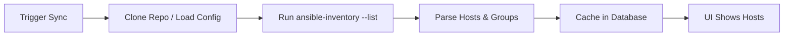

# Dynamic Inventories

Dynamic inventories let Stackweaver discover hosts automatically from cloud providers like Azure, AWS, and GCP instead of listing them manually. This guide covers both approaches for setting up dynamic inventories: VCS-backed plugin files (recommended for teams) and UI-configured sources (quick setup).

## How It Works

Traditional Ansible inventories are static files listing hosts and groups. Dynamic inventories replace that with a plugin that queries a cloud provider's API at sync time, discovers running VMs, and caches the results in Stackweaver's database. Your Ansible jobs then run against this cached inventory without re-querying the cloud on every job.



<details>
<summary><strong>Flow Steps (Legend)</strong></summary>

1. **Trigger** — You trigger a sync manually or via a schedule.
2. **Source** — The Ansible runner clones your repository (VCS type) or uses the UI-configured source settings.
3. **Discovery** — The runner runs `ansible-inventory --list` with the appropriate cloud credentials.
4. **Parse** — Discovered hosts and groups are parsed from the plugin output.
5. **Cache** — Results are stored in the database; the UI shows cached hosts and groups on the inventory's Hosts tab.

</details>

## Two Approaches

Stackweaver supports two ways to create dynamic inventories. Both are fully supported and neither is deprecated; choose the one that fits your workflow.

### VCS-Backed (Recommended for Teams)

Store your inventory plugin file (e.g., `azure_rm.yml`) in a Git repository and point Stackweaver to it. Changes you push to the repository are automatically picked up on the next sync. This approach works well for teams that version-control their infrastructure and want to review inventory configuration changes through pull requests.

### UI-Configured

Create a dynamic inventory directly in the Stackweaver UI by adding a cloud source (Azure, AWS, GCP, or VMware) and configuring it through form fields. This approach is faster to set up and works well for experimentation or when you do not need version control for the inventory configuration itself.

## Prerequisites

Before creating a dynamic inventory, you need the following depending on your cloud provider.

### Azure

- An Azure identity with at least the `Reader` role on the subscription or resource groups where the VMs are deployed. The kind of identity depends on the [authentication method](#azure-authentication-methods) you choose: a managed identity for Managed Identity / Workload Identity, or an App Registration (Service Principal) for the OIDC Federation and Cloud Credential methods.
- If using **OIDC Federation**, the `OIDC_SIGNING_KEY` and `OIDC_ISSUER_URL` must be set in `deploy/oidc.env`, at least one federated credential must be configured on the App Registration, and your issuer must be publicly reachable (see [Azure OIDC Configuration](azure-oidc-configuration.md)). The subject format for inventory sync is different from Terraform runs; see [OIDC Subject Formats](#oidc-subject-formats) for details. For VCS-backed inventories the subject contains the **inventory name**; for UI-configured sources it contains the **source name**, so a single inventory can have multiple sources each with their own federated credential.

### AWS

- An IAM role or user with `ec2:DescribeInstances` permission (and optionally `ec2:DescribeRegions`).
- Either an AWS credential stored in Stackweaver or OIDC workload identity federation (future).

### GCP

- A service account with `compute.instances.list` permission.
- Either a GCP credential stored in Stackweaver or workload identity federation (future).

## Creating a VCS-Backed Dynamic Inventory

### Step 1: Prepare the Inventory Plugin File

Create a YAML file in your repository that configures the Ansible inventory plugin for your cloud provider. The filename must end with the plugin-specific suffix so Ansible recognizes it.

For Azure, the file must end in `azure_rm.yml` or `azure_rm.yaml`. A minimal example:

```yaml
plugin: azure.azcollection.azure_rm
auth_source: auto
include_vm_resource_groups:
  - '*'
hostnames:
  - name
use_contrib_script_compatible_sanitization: true
keyed_groups:
  - key: tags
    prefix: tag
    separator: ''
```

For AWS, the file must end in `aws_ec2.yml` or `aws_ec2.yaml`:

```yaml
plugin: amazon.aws.aws_ec2
regions:
  - us-east-1
  - eu-west-1
keyed_groups:
  - key: tags.Name
    prefix: name
  - key: placement.region
    prefix: region
```

For GCP, the file must end in `gcp_compute.yml` or `gcp_compute.yaml`:

```yaml
plugin: google.cloud.gcp_compute
projects:
  - my-project-id
zones:
  - us-central1-a
auth_kind: application
keyed_groups:
  - key: labels.env
    prefix: env
```

Commit this file to a branch in your repository (typically `main`).

### Step 2: Create the Inventory in Stackweaver

Navigate to your organization's Ansible section and click "New Inventory". Fill in the following fields:

1. **Name**: A descriptive name for the inventory (e.g., "Azure Production VMs").
2. **Type**: Select "VCS".
3. **VCS Connection**: Select the GitHub, GitLab, or other VCS connection that has access to your repository.
4. **Repository**: Enter the repository in `owner/repo` format.
5. **Branch**: Enter the branch name (e.g., `main`).
6. **Inventory Path**: Enter the path to your inventory plugin file within the repository (e.g., `inventory/azure_rm.yml`).

Click "Create Inventory".

### Step 3: Sync the Inventory

After creating the inventory, click the "Sync" button in the top-right corner of the inventory detail page. This triggers the Ansible runner to clone the repository, run `ansible-inventory --list` with the plugin file, and cache the discovered hosts and groups.

If the sync succeeds, you will see a toast notification showing how many hosts were discovered (e.g., "Inventory synced successfully: 12 hosts discovered"). The Hosts tab will populate with the discovered machines and their variables (IP addresses, tags, instance IDs, etc.).

If the sync fails, a red error banner appears at the top of the inventory page showing the exact error output from Ansible. Click the copy icon on the banner to copy the error text for debugging.

If the sync succeeds but Ansible printed warnings to stderr, the sync status indicator in the tab bar turns amber instead of green (the host count still shows, so it is clear the sync worked). Click that amber icon to jump to the Syncs tab, where the full warning text appears at the top with a copy button. Common warnings include deprecated plugin options or network timeouts that did not prevent host discovery.

### Step 4: Use the Inventory in a Job

Once hosts are synced, you can use this inventory in any Ansible job template. The job will run against the cached hosts without re-querying the cloud provider. The cached inventory includes all hostvars (IP addresses, tags, metadata) that the plugin discovered.

To refresh the cache, click "Sync" again at any time. You can also set up scheduled syncs to automate this; see the Schedules feature in the Ansible section.

## Creating a UI-Configured Dynamic Inventory

### Step 1: Create the Inventory

Navigate to your organization's Ansible section and click "New Inventory". Set the type to "Dynamic" and give it a name.

### Step 2: Add a Cloud Source

On the inventory detail page, go to the Sources tab and click "Add Source". Fill in the source configuration:

1. **Name**: A label for this source (e.g., "Azure Production").
2. **Source Type**: Select your cloud provider (Azure, AWS, GCP, or VMware).
3. **Credential**: Select an existing cloud credential, or leave blank if your organization has OIDC workload identity configured. When OIDC is available, Stackweaver displays an "OIDC Workload Identity" badge and uses keyless authentication automatically.
4. **Provider-specific options**: Depending on the source type, configure resource groups, regions, zones, or other filters.

Click "Create Source".

### Step 3: Sync the Source

Click "Sync" on the source to trigger host discovery. The process is the same as VCS-backed inventories: the runner queries the cloud provider, parses the output, and caches hosts and groups in the database.

## Authentication

### Azure authentication methods

Azure inventory sync supports four authentication methods. For a UI-configured (dynamic) source you choose the method from the Authentication dropdown when you add or edit the source. A VCS-backed inventory is pure passthrough: you choose the method entirely in your own `azure_rm.yml` (via `auth_source`) and the pod runtime — there is no Stackweaver auth toggle for VCS inventories, so the repository stays the single source of truth. Every method runs plain `ansible-inventory` — the `azure.azcollection.azure_rm` plugin authenticates natively (federated tokens are read directly as of collection 3.17.0, so no wrapper is involved).

The most important distinction between the methods is whether they require your Stackweaver issuer to be reachable from Microsoft's public network.

| Method | Public issuer required? | Long-lived secret? | Best for |
|--------|-------------------------|--------------------|----------|
| Managed Identity (IMDS) | No | No | Stackweaver running inside Azure (AKS/VM) — the simplest keyless option |
| Workload Identity (AKS) | No | No | AKS clusters wanting per-workload identity isolation |
| OIDC Federation | Yes | No | Keyless auth from a Stackweaver that runs **outside** Azure (or a public deployment) |
| Cloud Credential (Service Principal) | No | Yes | Anywhere outbound to Entra is allowed and no managed identity is available |

**Managed Identity** is the right choice when Stackweaver runs inside Azure but has no public ingress. The runner authenticates outbound to the Azure Instance Metadata Service, so nothing needs to be exposed and no secret is stored. The node's kubelet or VM identity (system-assigned) or a user-assigned identity must hold the `Reader` role on the target subscription; for a user-assigned identity, supply its client ID in the source's Authentication panel. The generated plugin file uses `auth_source: msi`.

**Workload Identity** is the AKS-native evolution of managed identity. It federates a projected ServiceAccount token to a user-assigned managed identity through the cluster's own Azure-hosted OIDC issuer, so it is fully private from Stackweaver's perspective. Enable it on the chart with `ansibleRunner.workloadIdentity.enabled=true` and annotate the ServiceAccount with the identity's client ID (see the Kubernetes self-hosting guide). The runner automatically maps the workload-identity webhook's `AZURE_TENANT_ID` to the `AZURE_TENANT` variable the `azure_rm` plugin expects, so you do not need to set the tenant. The subscription is the one thing the webhook does not provide: for a UI-configured source it comes from the source's subscription field, and for a VCS-backed inventory the runner resolves it in order — `subscription_id` in your `azure_rm.yml` (so each inventory can target its own subscription), then your organization's Azure OIDC configuration subscription, and finally `AZURE_SUBSCRIPTION_ID` set on the runner via `ansibleRunner.env`. In practice a tags-only inventory file just works, because it falls back to the subscription already stored in your org's Azure OIDC configuration.

**OIDC Federation** is Stackweaver's own keyless mechanism, and it is the only method that needs a public surface: to verify the runner's Stackweaver-signed token, Microsoft Entra must reach your issuer's `/.well-known/openid-configuration` and JWKS endpoints over the public internet with a publicly trusted TLS certificate. It cannot be satisfied by Azure Private Link. Use it when the runner is not inside Azure at all (for example a multi-cloud or on-premises deployment). If your organization has an Azure OIDC configuration (set up via the Settings page or the `tfe_azure_oidc_configuration` Terraform resource), the runner generates a short-lived JWT at sync time, writes it to a temporary file, and sets `AZURE_FEDERATED_TOKEN_FILE`, `AZURE_CLIENT_ID`, `AZURE_TENANT_ID`, and `AZURE_SUBSCRIPTION_ID`.

### Cloud Credentials

Alternatively, you can create an Azure, AWS, or GCP credential in Stackweaver's Credentials section and attach it to your inventory source. For Azure this is the Service Principal method (client ID, secret, tenant); it works on a fully private deployment because the runner authenticates outbound to Entra, at the cost of storing a long-lived secret. The credential's secret values are injected as environment variables at sync time.

### Choosing a method on a private deployment

If your deployment has no public ingress, use **Managed Identity** or **Workload Identity** — both authenticate outbound and need no public endpoint. **OIDC Federation** still works if you can expose just the two discovery endpoints (`/.well-known/openid-configuration` and `/.well-known/jwks`) publicly with a trusted certificate; the Helm ingress already path-scopes exactly those routes. The **Service Principal** path is the simplest interim option when none of the above is available.

## Cloud Provider Detection

When you create a VCS-backed inventory pointing to a dynamic inventory plugin file, Stackweaver automatically detects the cloud provider and displays provider-specific branding throughout the UI:

- The inventory card on the list page shows the cloud provider's icon (Azure, AWS, or GCP) instead of a generic VCS icon.
- The inventory detail page header shows the provider icon next to the inventory name.
- In the metrics bar on the detail page, the Type indicator shows the provider name (e.g., "Azure Dynamic Inventory") instead of just "VCS".

UI-configured inventory sources also display familiar cloud provider icons. The source card on the Sources tab shows the Azure, AWS, or GCP logo alongside the source name, replacing the generic cloud icon. This makes it easy to tell at a glance which provider each source targets.

Detection works by examining the `plugin:` field in the YAML file content for VCS inventories, or the source type for UI-configured sources. If the file content is not yet loaded, Stackweaver falls back to recognizing patterns in the file path (e.g., `azure_rm` in the filename). This means you can name the file anything (e.g., `production.yml`) and detection still works as long as the `plugin:` key is present.

## Syncing and Live Status

When you click "Sync" on a VCS inventory or a UI-configured source, Stackweaver enqueues the sync job and polls for completion automatically. You do not need to refresh the page; the status badge on the inventory or source card updates in real time as the sync progresses. Once the sync finishes, a toast notification reports the result:

- On success: "Inventory synced successfully: N hosts discovered" (or "Source synced: N hosts discovered" for UI-configured sources).
- On failure: a toast with the error message, and a red error banner appears on the card with the full error output. You can copy the error text using the clipboard icon on the banner.
- If zero hosts are discovered, a warning toast appears suggesting you check the configuration and authentication settings.

The polling runs for up to 60 seconds. If the sync takes longer (for example, when querying a large cloud environment), a "taking longer than expected" message appears and you can revisit the page later to see the final result.

## Sync History

Every sync run is recorded on the inventory's Syncs tab, whether it was started manually, by a schedule, by a workflow node, as a pre-launch dependency update, or by a VCS webhook. Each entry shows the run's status, what triggered it, how many hosts and groups it discovered, and how long it took. Clicking a run opens the captured `ansible-inventory` output; while a sync is still running the dialog tails it live (the runner flushes output every couple of seconds), which is where plugin warnings and authentication errors surface — set the source's sync verbosity (0–4, adding `-v` through `-vvvv`) when you need more diagnostic detail in that log.

## Per-Source Sync Behavior

Each dynamic source carries its own sync behavior settings, editable on the source dialog:

- **Update on launch** syncs the source before every job that runs against the inventory. The job is created held and dispatches automatically once the sync finishes, so it always runs against fresh data. The **cache timeout** (seconds) skips that pre-launch sync while the last successful sync is newer than the window, which keeps frequent launches from hammering your cloud APIs.
- **Overwrite** removes hosts and groups that this source previously discovered but the provider no longer reports. Pruning is strictly scoped to rows owned by the source — manually created entries and rows discovered by other sources of the same inventory are never touched, so several sources (each with its own credential or Azure subscription) can safely feed one inventory.
- **Overwrite variables** replaces a host's variables wholesale on each sync. When it is off (the default), synced variables are merged into the existing ones — synced values win per key, but variables you added manually survive.

## Running Ad Hoc Commands

The Run Command button on the inventory detail page runs a single Ansible module against the inventory without creating a playbook or template — the platform generates a transient playbook and executes it through the normal job pipeline, so you get live output, events, and statistics on the standard job page. Pick a module, give it arguments (free-form for `command` and `shell`, `key=value` pairs for others), optionally limit the target hosts, choose a machine credential and where it runs (a platform runner or one of your self-hosted agent pools), and run. To target a single machine, use the terminal icon that appears on a host card in the Hosts tab — it opens the same dialog with the limit prefilled to that host. Which modules are allowed is an organization setting under Settings → Ansible (it defaults to AWX's allowlist), and running ad hoc commands requires a dedicated permission distinct from template execution.

## Constructed Inventories

A constructed inventory combines other inventories instead of querying a provider. When you create an inventory with the Constructed type, you pick the input inventories in order and optionally write `ansible.builtin.constructed` rules — `compose` derives new host variables, `groups` assigns membership by Jinja condition, and `keyed_groups` creates a group per value of a host variable. An optional limit pattern keeps only matching hosts. The constructed inventory rebuilds from its inputs before every job launch (bounded by its cache timeout) and on demand with the Rebuild button; each build appears in the Syncs tab with its full plugin output, which is the place to debug rule errors. Input inventories must belong to the same organization, cannot themselves be constructed, and cannot be deleted while a constructed inventory uses them.

## Deleting an Inventory

Deleting an inventory normally removes only the inventory and its hosts and groups. If the inventory is still referenced by job templates, jobs, or sources, the delete is rejected and the dialog explains what depends on it. From there you can choose **Force Delete Everything**, which removes the inventory together with every dependent resource — the job templates built on it (and their schedules, attached credentials and variables, notification attachments, and the workflow steps that run them), the jobs run against it and their event history, and its inventory sources — in a single operation. A constructed inventory that uses this inventory as an input keeps working but loses that input. Force delete cannot be undone and requires organization-level Ansible management permission.

## Viewing Synced Hosts

After a successful sync, the Hosts tab on the inventory detail page shows all discovered hosts with the variables reported by the cloud provider. For Azure VMs, this typically includes:

- **ansible_host**: The VM's private IP address or hostname.
- **tags**: All Azure tags assigned to the VM, available both as flat variables and as Ansible groups (via `keyed_groups`).
- **powerstate**: The VM's power state (e.g., `running`, `deallocated`).
- **resource_group**: The Azure resource group containing the VM.
- **location**: The Azure region where the VM is deployed.

Groups are automatically created based on the `keyed_groups` configuration in your inventory plugin file. For example, `keyed_groups` with `key: tags` creates a group for each tag value, letting you target VMs by tag in your playbooks.

## OIDC Subject Formats

When using OIDC workload identity, StackWeaver generates JWT tokens with a `sub` (subject) claim that must match a federated identity credential on your Azure App Registration. Terraform runs and StackWeaver-native resources (inventories, jobs) use different subject formats:

**Terraform runs** use the TFE-compatible format (unchanged by StackWeaver):

| Resource | Subject Format | Example |
|----------|---------------|---------|
| Terraform plan | `organization:<org>:project:<project>:workspace:<workspace>:run_phase:plan` | `organization:main:project:infra:workspace:production:run_phase:plan` |
| Terraform apply | `organization:<org>:project:<project>:workspace:<workspace>:run_phase:apply` | `organization:main:project:infra:workspace:production:run_phase:apply` |

**StackWeaver-native resources** use a simpler format without `run_phase:`:

| Resource | Subject Format | Example |
|----------|---------------|---------|
| Inventory sync | `organization:<org>:project:<project>:inventory:<inventory_name>:sync` | `organization:main:project:infra:inventory:azure-vms:sync` |
| Ansible job | `organization:<org>:project:<project>:job:<job_name>:run` | `organization:main:project:infra:job:deploy-app:run` |

The `<project>` is the actual StackWeaver project the resource belongs to. For org-scoped resources without a project, the project is `default`.

To allow inventory sync, add a federated credential on your App Registration with:

- **Issuer**: Your `OIDC_ISSUER_URL` (e.g., `https://app.stackweaver.io`)
- **Subject identifier**: `organization:<your-org>:project:<your-project>:inventory:<your-inventory-name>:sync`
- **Audience**: `api://AzureADTokenExchange`

If you have multiple inventories, you need a federated credential for each. Azure App Registrations support up to 20 federated credentials.

## Troubleshooting

### Sync fails with "name 'azure_cloud' is not defined"

The Ansible runner is missing the `azure-cli-core` Python package, which the `azure.azcollection` inventory plugin requires internally. The collection's `azure_rm_common.py` does `from azure.cli.core import cloud as azure_cloud`. If you are using a custom runner image, add `azure-cli-core` to your pip install:

```bash
pip install azure-cli-core
```

### Sync fails with authentication errors

Verify your OIDC or credential configuration. For OIDC, check that:

- The `OIDC_SIGNING_KEY` is set in `oidc.env` and both the API and runner containers share the same key.
- The federated credential on your Azure App Registration has the correct issuer URL (must match `OIDC_ISSUER_URL` exactly, no trailing slash).
- The App Registration has at least `Reader` role on the target subscription.

For credential-based auth, verify the client secret has not expired and the credential is attached to the inventory source.

### Sync succeeds but no hosts are found

Check that the `include_vm_resource_groups` setting in your inventory file includes the resource groups where VMs are deployed. Using `'*'` includes all resource groups. Also verify that VMs are in a `running` power state, deallocated VMs may not appear depending on your plugin configuration.

### Sync shows warnings about deprecated options

Some plugin options change between Ansible collection versions. Warnings about deprecated options do not prevent host discovery. Click the amber sync icon in the inventory's tab bar to open the Syncs tab, where you can read and copy the warnings and update your inventory file to use the recommended alternatives.