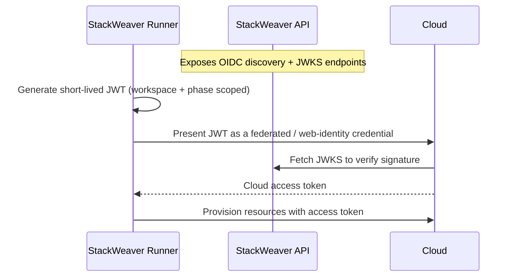

# OIDC Configuration

OIDC (OpenID Connect) configuration enables keyless authentication from Stackweaver-managed Terraform and Ansible runs to your cloud provider or HashiCorp Vault. Instead of storing long-lived credentials in your workspace variables, Stackweaver issues a short-lived signed JWT at run time, which the target accepts in exchange for a scoped access token via workload identity federation.

The same mechanism backs every supported target — only the trust setup on the target side and the registration resource differ:

| Target | Registration resource | Trust setup |
|--------|-----------------------|-------------|
| Azure | `tfe_azure_oidc_configuration` | App Registration + federated credential |
| AWS | `tfe_aws_oidc_configuration` | IAM OIDC identity provider + role trust policy |
| GCP | `tfe_gcp_oidc_configuration` | Workload Identity Pool + provider + service account binding |
| Vault | `tfe_vault_oidc_configuration` | JWT auth method + role (the runner logs in and exports `VAULT_TOKEN`) |

## How It Works



<details>
<summary><strong>Flow Steps (Legend)</strong></summary>

1. **OIDC provider** — Stackweaver exposes a signing key at `/.well-known/jwks` and a discovery document at `/.well-known/openid-configuration`.
2. **Cloud trust** — You configure your cloud to trust Stackweaver as an OIDC issuer (an Azure federated credential, an AWS IAM OIDC provider + role, or a GCP Workload Identity Pool provider).
3. **Registration** — You register the cloud-side identifiers in Stackweaver using the TFE Terraform provider (one resource per cloud).
4. **Run time** — The runner generates a short-lived JWT scoped to the specific workspace and run phase, and injects it alongside the cloud identifiers as environment variables. The cloud's Terraform provider and Ansible collection pick these up automatically, so no stored secret is needed.

</details>

## Prerequisites

- You must be an organization owner in Stackweaver, or have the `manage-vcs-settings` permission.
- You must have the `hashicorp/tfe` Terraform provider configured against your Stackweaver instance.
- Your Stackweaver issuer must be **publicly reachable** by the cloud provider (it fetches the JWKS to verify tokens). See [Operator Configuration](#operator-configuration-deployoidcenv).
- You need permission on the cloud side to create the relevant trust (App Registration / IAM OIDC provider + role / Workload Identity Pool).

## The Token Subject (shared across clouds)

Stackweaver embeds a subject in every workload identity token; your cloud-side trust matches on it. The format depends on the resource type.

**Terraform workspace runs** (plan/apply):

```
organization:<org-name>:project:<project-name>:workspace:<workspace-name>:run_phase:<plan|apply>
```

For example, the `apply` phase of the `production` workspace in project `infra` under organization `main`:

```
organization:main:project:infra:workspace:production:run_phase:apply
```

`plan` and `apply` produce **different subjects**, so where the cloud matches an exact subject you need to allow both (or use a wildcard/attribute condition where supported).

**Ansible inventory sync** (StackWeaver-native format, no `run_phase:`):

```
organization:<org-name>:project:<project-name>:inventory:<name>:sync
```

`<name>` is the **inventory name** for VCS-backed inventories, or the **source name** for UI-configured (dynamic) inventories — so a single inventory can have multiple cloud sources, each with its own credential.

**Ansible job execution** (StackWeaver-native format):

```
organization:<org-name>:project:<project-name>:job:<job-name>:run
```

`<project-name>` is the StackWeaver project the resource belongs to, or `default` for org-scoped resources without a project.

### Pinning to immutable identifiers

The subject is built from organization, project, and workspace **names**, which can be renamed. Organization names are permanently reserved once used — a deleted organization's name can never be re-registered — so a deleted org's name cannot be reclaimed by someone else. For defense in depth, where your cloud provider lets you match on token claims beyond `sub`, every token also carries the immutable UUIDs of the resources it was minted for: `stackweaver_organization_id`, `stackweaver_project_id`, and `stackweaver_workspace_id` (Terraform runs) or `stackweaver_organization_id` and `stackweaver_project_id` (Ansible resources). Adding a claim condition on `stackweaver_organization_id` alongside the subject ensures a token is only accepted for the exact organization you trust regardless of any later rename. You can find an organization's ID in its settings, or in the `id` field of the organization's API response.

---

## Azure

Keyless auth to Azure uses an Entra ID App Registration with a federated credential that trusts Stackweaver.

### Step 1: Create an App Registration in Azure Entra ID

1. Sign in to the [Azure Portal](https://portal.azure.com).
2. Navigate to **Microsoft Entra ID** > **App registrations** > **New registration**.
3. Fill in the form:
   - **Name**: something descriptive, such as `stackweaver-automation`.
   - **Supported account types**: "Accounts in this organizational directory only (Single tenant)".
   - **Redirect URI**: leave blank.
4. Click **Register**.
5. On the **Overview** page, note these values:

   | TFE provider argument | Azure Portal label |
   |-----------------------|--------------------|
   | `client_id` | Application (client) ID |
   | `tenant_id` | Directory (tenant) ID |
   | `subscription_id` | Found under **Subscriptions** in the portal |

### Step 2: Assign Azure RBAC Roles

The App Registration needs permission to create and manage Azure resources on behalf of your automation. Because Terraform often needs to assign roles (e.g., granting a managed identity access to a Key Vault), `Contributor` is not sufficient — role assignment requires `Owner`.

1. Navigate to the **Subscription** (or **Management Group** for cross-subscription scope) where your automation will run.
2. Go to **Access control (IAM)** > **Add role assignment**.
3. Select **Owner**.
4. Under **Assign access to**, select **User, group, or service principal**, search for the App Registration name, and select it.
5. Click **Review + assign**.

> [!WARNING]
> `Owner` at subscription scope grants full control over all resources and role assignments. Assign it only to service principals, and revoke it when no longer needed. If your automation never manages RBAC assignments, `Contributor` is a safer alternative.

### Step 3: Configure a Federated Identity Credential

1. In the App Registration, go to **Certificates & secrets** > **Federated credentials** > **Add credential**.
2. For **Federated credential scenario**, select **Other issuer**.
3. Fill in the fields:

   | Field | Value |
   |-------|-------|
   | **Issuer** | The public URL of your Stackweaver instance, e.g. `https://stackweaver.example.com` |
   | **Subject identifier** | A subject from [The Token Subject](#the-token-subject-shared-across-clouds) |
   | **Name** | A descriptive label, e.g. `stackweaver-my-org-plan` |
   | **Audience** | `api://AzureADTokenExchange` |

4. Click **Add**. Create one credential for `run_phase:plan` and one for `run_phase:apply` to cover the full Terraform run lifecycle.

### Step 4: Register the Configuration in Stackweaver

```hcl
resource "tfe_azure_oidc_configuration" "main" {
  organization    = "your-org-name"
  client_id       = "xxxxxxxx-xxxx-xxxx-xxxx-xxxxxxxxxxxx"  # Application (client) ID
  subscription_id = "yyyyyyyy-yyyy-yyyy-yyyy-yyyyyyyyyyyy"  # Azure subscription ID
  tenant_id       = "zzzzzzzz-zzzz-zzzz-zzzz-zzzzzzzzzzzz"  # Directory (tenant) ID
}
```

After `terraform apply`, Stackweaver returns an `id` in the form `azoidc-{16-char-alphanumeric}`.

### Step 5: Configure the azurerm Provider in Your Workspaces

Configure the `azurerm` provider to use OIDC. Do not set `client_secret` or `use_msi`:

```hcl
provider "azurerm" {
  features {}
  use_oidc = true
}
```

The runner injects these environment variables automatically:

| Variable | Description |
|----------|-------------|
| `TFC_WORKLOAD_IDENTITY_TOKEN` | Short-lived RS256 JWT signed by Stackweaver |
| `ARM_OIDC_TOKEN` | Same JWT (read by the `azurerm` and `azapi` providers) |
| `ARM_CLIENT_ID` | The `client_id` you registered |
| `ARM_SUBSCRIPTION_ID` | The `subscription_id` you registered |
| `ARM_TENANT_ID` | The `tenant_id` you registered |
| `ARM_USE_OIDC` | `true` |

---

## AWS

Keyless auth to AWS uses an IAM OIDC identity provider plus a role whose trust policy accepts Stackweaver's web-identity token (`AssumeRoleWithWebIdentity`). The token audience is `sts.amazonaws.com`.

### Step 1: Create an IAM OIDC Identity Provider

1. In the AWS Console, go to **IAM** > **Identity providers** > **Add provider**.
2. Select **OpenID Connect**.
3. **Provider URL**: the public URL of your Stackweaver instance, e.g. `https://stackweaver.example.com`. Click **Get thumbprint**.
4. **Audience**: `sts.amazonaws.com`.
5. Click **Add provider**.

### Step 2: Create an IAM Role with a Web-Identity Trust Policy

Create a role your automation will assume, trusting the provider from Step 1 and restricting it to your run's subject:

```json
{
  "Version": "2012-10-17",
  "Statement": [{
    "Effect": "Allow",
    "Principal": { "Federated": "arn:aws:iam::123456789012:oidc-provider/stackweaver.example.com" },
    "Action": "sts:AssumeRoleWithWebIdentity",
    "Condition": {
      "StringEquals": {
        "stackweaver.example.com:aud": "sts.amazonaws.com",
        "stackweaver.example.com:sub": "organization:main:project:infra:workspace:production:run_phase:apply"
      }
    }
  }]
}
```

Add a condition entry for each subject you want to allow (`plan` and `apply` are distinct), or use `StringLike` with a wildcard. Attach whatever resource-management permissions your automation needs to the role.

### Step 3: Register the Configuration in Stackweaver

```hcl
resource "tfe_aws_oidc_configuration" "main" {
  organization = "your-org-name"
  role_arn     = "arn:aws:iam::123456789012:role/stackweaver-oidc"
}
```

After `terraform apply`, Stackweaver returns an `id` in the form `awsoidc-{16-char-alphanumeric}`.

### Step 4: Configure the aws Provider in Your Workspaces

No provider block changes are required — the `aws` provider performs `AssumeRoleWithWebIdentity` automatically from the injected environment. The runner writes the token to a file and sets:

| Variable | Description |
|----------|-------------|
| `AWS_ROLE_ARN` | The `role_arn` you registered |
| `AWS_WEB_IDENTITY_TOKEN_FILE` | Path to the short-lived JWT (the AWS SDK reads the token from a file, not an env value) |
| `AWS_ROLE_SESSION_NAME` | A per-run session name (`stackweaver-<run-id>`) |

---

## GCP

Keyless auth to GCP uses Workload Identity Federation: a Workload Identity Pool with an OIDC provider that trusts Stackweaver, bound to a service account your automation impersonates. The token audience is `//iam.googleapis.com/<workload-provider-name>`.

### Step 1: Create a Workload Identity Pool and OIDC Provider

```bash
gcloud iam workload-identity-pools create stackweaver \
  --location=global --display-name="Stackweaver"

gcloud iam workload-identity-pools providers create-oidc stackweaver \
  --location=global --workload-identity-pool=stackweaver \
  --issuer-uri="https://stackweaver.example.com" \
  --attribute-mapping="google.subject=assertion.sub" \
  --allowed-audiences="//iam.googleapis.com/projects/123456789012/locations/global/workloadIdentityPools/stackweaver/providers/stackweaver"
```

Note the numeric **project number** and the full **provider resource name** (`projects/<number>/locations/global/workloadIdentityPools/<pool>/providers/<provider>`) — you register both in Step 3.

### Step 2: Bind the Service Account

Grant the pool's identities permission to impersonate the service account your automation uses, scoped to the run subject:

```bash
gcloud iam service-accounts add-iam-policy-binding \
  stackweaver@my-project.iam.gserviceaccount.com \
  --role=roles/iam.workloadIdentityUser \
  --member="principal://iam.googleapis.com/projects/123456789012/locations/global/workloadIdentityPools/stackweaver/subject/organization:main:project:infra:workspace:production:run_phase:apply"
```

Add a binding per subject you want to allow (`plan` and `apply` are distinct), or bind on a mapped attribute. Grant the service account itself whatever resource-management roles your automation needs.

### Step 3: Register the Configuration in Stackweaver

```hcl
resource "tfe_gcp_oidc_configuration" "main" {
  organization           = "your-org-name"
  service_account_email  = "stackweaver@my-project.iam.gserviceaccount.com"
  project_number         = "123456789012"
  workload_provider_name = "projects/123456789012/locations/global/workloadIdentityPools/stackweaver/providers/stackweaver"
}
```

After `terraform apply`, Stackweaver returns an `id` in the form `gcpoidc-{16-char-alphanumeric}`.

### Step 4: Configure the google Provider in Your Workspaces

No provider block credentials are required — the `google` provider reads an external-account credential configuration automatically from the injected environment. The runner writes the token and a credential-config file and sets:

| Variable | Description |
|----------|-------------|
| `GOOGLE_APPLICATION_CREDENTIALS` | Path to an `external_account` credential-config JSON (references the token file + STS token-exchange and impersonation URLs) |
| `TFC_GCP_PROVIDER_AUTH` | `true` |
| `TFC_GCP_RUN_SERVICE_ACCOUNT_EMAIL` | The `service_account_email` you registered |
| `TFC_GCP_WORKLOAD_PROVIDER_NAME` | The `workload_provider_name` you registered |
| `TFC_GCP_PROJECT_NUMBER` | The `project_number` you registered |

Set the `project` (and `region`) in your `google` provider block as usual.

---

## Vault

HashiCorp Vault differs from the cloud providers: instead of the provider exchanging a token, the
**runner logs in to Vault** via the JWT auth method and exports a `VAULT_TOKEN` for the run. Point the
Vault JWT auth method at Stackweaver as an OIDC issuer, then register the config. The token audience is
`vault.workload.identity`.

### Step 1: Enable and Configure the JWT Auth Method

```bash
vault auth enable jwt

# Trust Stackweaver's JWKS (or use oidc_discovery_url with the issuer for full discovery).
vault write auth/jwt/config \
  jwks_url="https://stackweaver.example.com/.well-known/jwks"
```

### Step 2: Create a Role Bound to the Run

```bash
vault write auth/jwt/role/stackweaver \
  role_type="jwt" \
  bound_audiences="vault.workload.identity" \
  user_claim="sub" \
  bound_subject="organization:main:project:infra:workspace:production:run_phase:apply" \
  token_policies="my-policy" \
  token_ttl="20m"
```

Create a role (or `bound_subject`/`bound_claims` entry) per subject you want to allow — see
[The Token Subject](#the-token-subject-shared-across-clouds); `plan` and `apply` are distinct. Attach
the Vault policies your run needs via `token_policies`.

### Step 3: Register the Configuration in Stackweaver

```hcl
resource "tfe_vault_oidc_configuration" "main" {
  organization = "your-org-name"
  address      = "https://vault.example.com:8200"
  role_name    = "stackweaver"
  namespace    = "admin" # required by the provider; any value for Vault OSS (sent as X-Vault-Namespace)
  auth_path    = "jwt"   # optional, defaults to "jwt"
  # encoded_cacert = filebase64("vault-ca.pem")  # optional, for a private Vault CA
}
```

After `terraform apply`, Stackweaver returns an `id` in the form `vaultoidc-{16-char-alphanumeric}`.

### Step 4: Use the vault Provider in Your Workspaces

No provider block credentials are required — the runner logs in to Vault before the run and exports the
token. The `vault` provider (and any provider reading `VAULT_*`) picks it up automatically:

| Variable | Description |
|----------|-------------|
| `VAULT_ADDR` | The `address` you registered |
| `VAULT_TOKEN` | The client token from the JWT-auth login |
| `VAULT_NAMESPACE` | The `namespace` you registered (when set) |
| `VAULT_CACERT` | Path to the CA cert file (when `encoded_cacert` is set) |

---

## Operator Configuration (deploy/oidc.env)

Two variables in `deploy/oidc.env` control how Stackweaver issues OIDC tokens (the same for every cloud). Copy `deploy/oidc.env.example` to `deploy/oidc.env` and fill in the values.

| Variable | Required | Description |
|----------|----------|-------------|
| `OIDC_SIGNING_KEY` | **Yes** | Base64-encoded RSA-2048 private key used to sign workload identity tokens. |
| `OIDC_ISSUER_URL` | **Yes** | The public URL embedded in tokens and the OIDC discovery document. Must match the **Issuer** you configured on the cloud side exactly (no trailing slash). |

### Why the signing key is required

Stackweaver runs two separate containers that participate in OIDC: the API (which serves the JWKS public key endpoint the cloud fetches) and the runner (which signs the workload identity token injected into each run). If `OIDC_SIGNING_KEY` is not set, each container auto-generates its own independent RSA key pair on startup. The runner then signs tokens with its key, while the API advertises a different public key in the JWKS endpoint — so the cloud cannot find a key matching the `kid` in the runner's token and rejects it (e.g. Azure's `AADSTS700211`).

Setting a shared `OIDC_SIGNING_KEY` ensures both containers use the same key pair.

### Why the key must be base64-encoded

Docker Compose `env_file` does not support multi-line values. A raw PEM key spans multiple lines; base64 collapses it to a single line `env_file` can read.

### Generating the signing key

```bash
make setup-oidc-key
```

This generates a 2048-bit RSA key, base64-encodes it, and appends it to `deploy/oidc.env`. Alternatively, generate manually:

```bash
openssl genrsa 2048 | base64 -w 0
# Copy the single-line output and set it as OIDC_SIGNING_KEY in deploy/oidc.env
```

After editing `oidc.env`, run `make fresh-backend` to restart the API and runner with the new configuration.

## Troubleshooting

### `403 Forbidden` when creating the OIDC configuration

Your Stackweaver token does not have the `manage-vcs-settings` permission. Perform the configuration as an organization owner, or ask an owner to grant you that permission.

### The cloud rejects the token with "no matching identity" (e.g. Azure `AADSTS70021`, AWS `Not authorized to perform sts:AssumeRoleWithWebIdentity`, GCP `unable to verify`)

The issuer, subject, or audience in the token does not match your cloud-side trust. Check:

- The **Issuer** configured on the cloud matches `OIDC_ISSUER_URL` (or `API_URL` if that variable is not set) exactly, with no trailing slash, and is publicly reachable.
- The **Subject** matches the run that failed — see [The Token Subject](#the-token-subject-shared-across-clouds). `plan` and `apply` have different subjects and each needs its own trust entry.
- The **Audience** matches the cloud: `api://AzureADTokenExchange` (Azure), `sts.amazonaws.com` (AWS), or `//iam.googleapis.com/<workload-provider-name>` (GCP).

### Tokens are rejected only after a Stackweaver restart, or intermittently

`OIDC_SIGNING_KEY` is not set, so a new RSA key pair is generated on each startup (and the API/runner may hold different keys). Set a stable, shared `OIDC_SIGNING_KEY` in `deploy/oidc.env` and run `make fresh-backend`.

### Azure: `Contributor` role is not sufficient

If Terraform gets an `AuthorizationFailed` error creating role assignments (e.g., for managed identities), the App Registration needs the `Owner` role, not `Contributor`.
