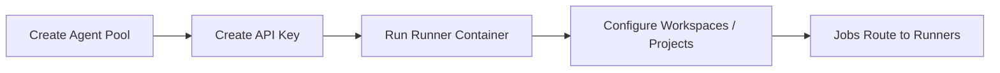

# Self-Hosted Runners

Learn how to run Terraform and Ansible workloads on your own infrastructure using StackWeaver self-hosted runners. By the end of this guide, you will know how to create agent pools, register runners, and route jobs to them.

## What Are Self-Hosted Runners?

StackWeaver can execute Terraform plans and applies and Ansible jobs in two ways:

| Execution type | Description |
|----------------|-------------|
| **Platform-hosted** | StackWeaver runs jobs in containers it manages. No infrastructure for you to operate. |
| **Self-hosted** | You run a runner container on your own servers or Kubernetes. Jobs are assigned to your runners via agent pools. |

Self-hosted runners use the **same runner images** as platform-hosted runs. The only difference is how the runner gets work: platform-hosted runners are started on demand by StackWeaver; self-hosted runners run continuously and poll for jobs. This is useful when you need workloads to run inside your network, on specific hardware, or under your own compliance and security controls.

## When to Use Self-Hosted Runners

Consider self-hosted runners when you:

- Need Terraform or Ansible to run inside your private network (e.g., to reach internal APIs or databases).
- Want to control where and how jobs run for compliance or security.
- Prefer to scale capacity yourself instead of using platform-hosted execution.
- Use the same patterns as Terraform Cloud / HCP Terraform agent pools and want compatibility with tools like the Terraform provider for TFE.

## What You'll Need

Before you start, make sure you have:

| Requirement | Description |
|-------------|-------------|
| **StackWeaver account** | Sign in to your organization. |
| **Organization admin or runner permissions** | You need permission to manage agent pools and API keys with runner scopes. |
| **Docker (or Kubernetes)** | A host where you can run the runner container. |
| **Outbound HTTPS access** | The runner must reach your StackWeaver API (e.g. `https://your-stackweaver.example.com`). |

## Overview: Agent Pools and Runners

**Agent pools** group runners and define which workspaces or projects can use them. You create a pool in Settings, then register runners into that pool. When you configure a workspace (or project) to use agent execution, you attach it to a pool; jobs for that workspace or project are then dispatched to runners in that pool.

**Runners** are the containers that poll for jobs and execute them. Each runner belongs to one agent pool and is registered using an API key with runner scopes. After registration, the runner appears in Settings > Runners and shows status (online, busy, offline), type (Terraform, Ansible, or combined), and last heartbeat.

The flow is:



<details>
<summary><strong>Flow Steps (Legend)</strong></summary>

1. **Agent pool** - Create an agent pool and optionally restrict which workspaces or projects can use it.
2. **API key** - Create an API key with runner scopes.
3. **Runner** - Run the runner container with that API key and the pool ID; the runner registers itself.
4. **Routing** - Configure workspaces (Terraform) or projects (Ansible) to use agent execution and the correct pool so jobs are routed to your runners.

</details>

---

## Step 1: Create an Agent Pool

Agent pools are managed per organization under **Settings > Agent Pools**.

1. In your organization, go to **Settings** (from the sidebar or org menu).
2. Open **Agent Pools**.
3. Click **New Agent Pool** (or the equivalent create action).
4. Give the pool a name (e.g. `production-runners` or `ansible-pool`).
5. Choose **Organization-scoped** or **Restricted**:
   - **Organization-scoped**: The pool is available to all workspaces in the organization unless you exclude specific workspaces.
   - **Restricted**: The pool is available only to workspaces or projects you explicitly allow.
6. If restricted, add the allowed workspaces or projects.
7. Save the pool.

You can later edit the pool to change allowed or excluded workspaces and projects. The list of runners in each pool is shown on the Agent Pools page.

> [!TIP]
> Create separate pools for different environments (e.g. `dev-pool` and `prod-pool`) so you can assign workspaces to the right runners.

---

## Step 2: Create an API Key with Runner Scopes

Runners authenticate using the same API key system as the rest of StackWeaver. You create a key with runner scopes and use it only when starting the runner. This key is a *registration* credential: when a runner registers, the API issues it its own runner-scoped token, and the runner uses that token - not your registration key - for every heartbeat and job afterward. That means you can safely revoke the registration key once your runners are up; they keep running until they next restart and need to register again.

1. Go to **Settings > API Keys**.
2. Create a new API key.
3. For the organization, select the same organization that owns the agent pool.
4. Enable the **Runner** permissions your runners need:
   - **Runner: Register** – required so the runner can register with the API.
   - **Runner: Terraform** and/or **Runner: Ansible** (or **Runner: Combined** if one runner will do both).
5. Save the key and **copy the token** (e.g. `tfe-xxx...`). You will not see it again.

Use this token only when starting the runner container. Do not commit it to source control or share it broadly. You can revoke the key at any time in Settings > API Keys. Because each runner switches to its own runner-scoped token after registration, revoking the registration key does not interrupt runners that are already registered - they keep receiving jobs until they restart, at which point they need a valid registration key to register again.

> [!TIP]
> **Pool-scoped agent tokens.** Instead of a general runner-scoped API key, you can create an agent token directly on a pool: expand the pool on the **Settings > Agent Pools** page and use its **Agent tokens** section (create with a description, copy the value once, revoke when done). An agent token is a registration credential **bound to that one pool** - a runner presenting it can only join that pool - so it is the safest way to hand out registration access per environment. This is the Terraform-compatible `tfe_agent_token` resource, so you can also manage these tokens with the `hashicorp/tfe` provider. Everything below works the same whichever kind of registration token you use.

---

## Step 3: Run the Runner

You run the same container images StackWeaver uses for platform-hosted execution, but in **agent mode**. The runner registers with the API, polls for jobs, and runs them locally on your infrastructure.

### Required values

Before starting a runner, gather the following values.

| Value | Where to find it | Example |
|-------|-------------------|---------|
| **Agent pool ID** | Agent Pools UI (pool detail page or URL) | `a1b2c3d4-e5f6-7890-abcd-ef1234567890` |
| **API key** | The token you created in Step 2 | `tfe-xxx...` |
| **StackWeaver server** | Your StackWeaver URL | `https://app.stackweaver.io` |

### Docker

Use `docker run` to start a runner on any machine with Docker installed. Replace `<pool-uuid>`, `<your-api-key>`, and the server URL with your actual values.

#### Ansible runner (Docker)

```bash
docker run -d --restart unless-stopped \
  -e RUNNER_MODE=agent \
  -e RUNNER_AGENT_POOL_ID=<pool-uuid> \
  -e STACKWEAVER_TOKEN=<your-api-key> \
  -e STACKWEAVER_SERVER=https://your-stackweaver.example.com \
  -e RUNNER_NAME=my-ansible-runner \
  stackweaver/runner-ansible:latest
```

#### Terraform runner (Docker)

```bash
docker run -d --restart unless-stopped \
  -e RUNNER_MODE=agent \
  -e RUNNER_AGENT_POOL_ID=<pool-uuid> \
  -e STACKWEAVER_TOKEN=<your-api-key> \
  -e STACKWEAVER_SERVER=https://your-stackweaver.example.com \
  -e RUNNER_NAME=my-terraform-runner \
  stackweaver/runner-terraform:latest
```

### Kubernetes

To run self-hosted runners on Kubernetes, create a Secret with your API key and deploy a runner using a Deployment manifest.

#### Step 3a: Create a Secret for the API key

```bash
kubectl create secret generic stackweaver-runner-token \
  --namespace <runner-namespace> \
  --from-literal=token=<your-api-key>
```

#### Step 3b: Deploy the runner

Apply a Deployment manifest for the runner type you need. The examples below deploy a single replica; increase `replicas` to run multiple runners in the same pool.

**Terraform runner (Kubernetes):**

```yaml
apiVersion: apps/v1
kind: Deployment
metadata:
  name: stackweaver-terraform-runner
  namespace: <runner-namespace>
spec:
  replicas: 1
  selector:
    matchLabels:
      app: stackweaver-terraform-runner
  template:
    metadata:
      labels:
        app: stackweaver-terraform-runner
    spec:
      containers:
        - name: runner
          image: stackweaver/runner-terraform:latest
          env:
            - name: RUNNER_MODE
              value: agent
            - name: RUNNER_AGENT_POOL_ID
              value: "<pool-uuid>"
            - name: STACKWEAVER_SERVER
              value: "https://your-stackweaver.example.com"
            - name: RUNNER_NAME
              valueFrom:
                fieldRef:
                  fieldPath: metadata.name
            - name: STACKWEAVER_TOKEN
              valueFrom:
                secretKeyRef:
                  name: stackweaver-runner-token
                  key: token
          resources:
            requests:
              cpu: 200m
              memory: 256Mi
            limits:
              cpu: "1"
              memory: 1Gi
```

**Ansible runner (Kubernetes):**

```yaml
apiVersion: apps/v1
kind: Deployment
metadata:
  name: stackweaver-ansible-runner
  namespace: <runner-namespace>
spec:
  replicas: 1
  selector:
    matchLabels:
      app: stackweaver-ansible-runner
  template:
    metadata:
      labels:
        app: stackweaver-ansible-runner
    spec:
      containers:
        - name: runner
          image: stackweaver/runner-ansible:latest
          env:
            - name: RUNNER_MODE
              value: agent
            - name: RUNNER_AGENT_POOL_ID
              value: "<pool-uuid>"
            - name: STACKWEAVER_SERVER
              value: "https://your-stackweaver.example.com"
            - name: RUNNER_NAME
              valueFrom:
                fieldRef:
                  fieldPath: metadata.name
            - name: STACKWEAVER_TOKEN
              valueFrom:
                secretKeyRef:
                  name: stackweaver-runner-token
                  key: token
          resources:
            requests:
              cpu: 200m
              memory: 256Mi
            limits:
              cpu: "1"
              memory: 1Gi
```

Apply the manifest with `kubectl apply -f runner.yaml`. The runner pod starts, registers with the API, and appears in **Settings > Runners**.

> [!TIP]
> Use `RUNNER_NAME` with `fieldRef: metadata.name` so each pod automatically gets a unique name in the UI. If you scale to multiple replicas, every pod registers as a separate runner in the same pool.

### Optional environment variables

These variables work with both Docker and Kubernetes deployments.

| Variable | Description | Default |
|----------|-------------|---------|
| `RUNNER_NAME` | Name shown in the UI (e.g. hostname). | Hostname |
| `RUNNER_LABELS` | Comma-separated labels for targeting (e.g. `production,gpu`). | (none) |
| `MAX_CONCURRENT_JOBS` | How many jobs this runner can run at once. | 1 |

After the runner starts, it registers with the API and appears under **Settings > Runners** with status **Online** once heartbeats are received. You can open a runner from the list to see details, labels, and recent jobs.

> [!NOTE]
> The **Add runner** dialog in Settings > Runners shows Docker commands with your pool ID and server URL filled in. Use the copy button there as a starting point, then replace `<your-api-key>` with your actual token. For Kubernetes, use the Docker commands as a reference for the environment variables to include in your manifest.

---

## Step 4: Route Work to Your Runners

### Terraform workspaces

For Terraform, runs are routed to a pool when the workspace uses **agent** execution mode and is associated with that pool.

1. Open the workspace you want to run on self-hosted runners.
2. Edit the workspace (e.g. **Settings** or **Edit** on the workspace).
3. Set **Execution mode** to **Agent**.
4. If your UI has an **Agent pool** (or similar) field, select the pool you created.
5. Save.

Subsequent plan and apply runs for that workspace will be assigned to runners in the selected pool instead of platform-hosted execution.

### Routing every workspace by default

Setting each workspace individually does not scale once you have more than a handful. Instead, set an organization-wide default: open **Settings → Agent Pools** and use the **Default execution** section at the top to choose **Agent** and the pool you want. Every workspace then runs on that pool without being configured, and you only touch the ones that need something different.

Stackweaver resolves execution settings when a run starts, taking the most specific setting that applies. A workspace with its own execution mode always wins. Otherwise the workspace's project decides, if the project set its own defaults. Only when neither has expressed a preference does the organization default apply. A project that has deliberately chosen a non-agent mode is respected, so it will not be pulled onto agents by an organization default.

The same settings are available to Terraform configuration through the `tfe_organization_default_settings` resource, so you can manage them alongside the rest of your platform.

### Ansible jobs

For Ansible, job routing is typically controlled at the project or organization level via the agent pool configuration. Ensure the agent pool’s allowed workspaces or projects include the workspaces or projects where your Ansible jobs run. Jobs in those scopes will then be eligible to run on runners in that pool.

---

## Step 5: Optional – Ansible Configuration

If you use Ansible, you can customize `ansible.cfg` per organization, project, or workspace so that jobs run with your preferred settings (e.g. timeouts, SSH options, callback plugins).

1. Go to **Settings > Ansible Configuration**.
2. Choose the scope: **Organization**, or a **Project** (and optionally a workspace if supported).
3. Edit the configuration content. The UI often provides a default template; you can modify sections such as `[defaults]` and `[ssh_connection]`.
4. Save.

When a job runs (on a platform-hosted or self-hosted runner), StackWeaver injects the appropriate `ansible.cfg` into the job environment. More specific scope overrides less specific (e.g. workspace over project over organization).

---

## Managing and Monitoring Runners

### Settings > Runners

The **Runners** page lists all runners in the organization. For each runner you can see:

- **Status**: Online, Busy, Offline, or Error.
- **Type**: Terraform, Ansible, or Combined.
- **Agent pool**: Which pool the runner belongs to.
- **Hostname and IP**: Reported by the runner.
- **Last heartbeat**: How recently the runner checked in.
- **Current load**: e.g. number of jobs running vs. max concurrent.

Clicking a runner opens its detail page with system info, capabilities, labels, and recent job history.

### Runner status

Runners send heartbeats to the API on a regular interval. If heartbeats stop (e.g. container down or network issue), StackWeaver marks the runner **Offline** after a short period. No new jobs are assigned to offline runners. When the runner comes back and heartbeats again, it returns to **Online** and can receive jobs again.

### Editing and deleting

- **Edit**: From the runner list or detail page, use **Edit** to change the runner’s description and labels. Labels can be used for job targeting (e.g. route only to runners with a `gpu` label).
- **Delete**: Deleting a runner removes it from the UI. The container will no longer receive jobs. To use that host again, run the container again with the same or a new API key; it will register as a new runner.

---

## Security and Best Practices

1. **API keys**: Create API keys with the minimum scopes needed (e.g. only Runner: Register and Runner: Terraform for a Terraform-only runner). Rotate or revoke keys if they may have been exposed.
2. **Network**: Runners initiate all connections to StackWeaver (outbound only). You do not need to open inbound ports on the runner. Use TLS for the StackWeaver server URL.
3. **Pools**: Use separate pools for different trust or network boundaries (e.g. DMZ vs. internal), and restrict which workspaces or projects can use each pool.
4. **Resource limits**: Use Docker (or Kubernetes) resource limits so a single job cannot exhaust the host. Tune `MAX_CONCURRENT_JOBS` based on your host size.

---

## Common Questions

**Q: Can one runner run both Terraform and Ansible jobs?**  
A: Yes, if you use a **combined** runner image (when available) or register with scopes that allow both. Otherwise use separate Ansible and Terraform runner containers and put them in the same or different pools as needed.

**Q: What happens if all runners in a pool are offline?**  
A: New jobs that are assigned to that pool will wait until a runner in the pool is online. Ensure at least one runner in the pool is running for critical workloads, or use platform-hosted execution as a fallback by not using agent mode for that workspace.

**Q: How do I update the runner image?**  
A: Pull the new image, stop the old container, and start a new one with the same environment variables (same pool ID and a valid API key). The new container will register and appear as the same or a new runner depending on implementation; check the Runners UI after restart.

**Q: My runner stays Offline.**  
A: Check that the container is running, that `STACKWEAVER_SERVER` and `STACKWEAVER_TOKEN` are correct, and that the host can reach the StackWeaver API over HTTPS. Check container logs for registration or heartbeat errors.

---

## What's Next?

- Use [Managing Workspace Variables](./managing-workspace-variables.md) to configure variables for workspaces that run on your runners.
- Use [Understanding Terraform Runs](./understanding-terraform-runs.md) to interpret plan and apply output for runs executed on your runners.
- Use [Running Your First Ansible Job](../get-started/your-first-ansible-job.md) to run Ansible jobs that can be routed to your self-hosted Ansible runners.
