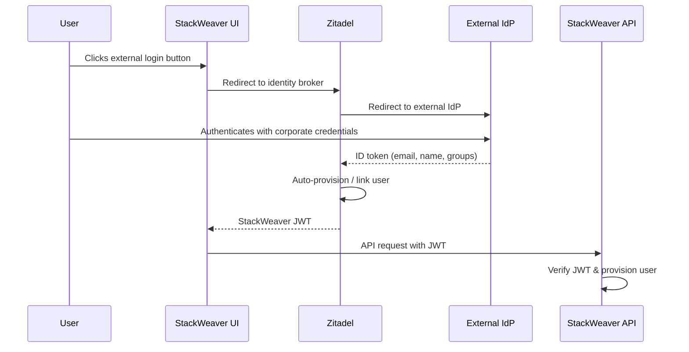

# Single Sign-On (SSO) Integration

StackWeaver supports federated authentication through external identity providers (IdPs). Users can sign in with their corporate credentials from Azure AD/Entra ID, Okta, AWS Cognito, or any OIDC-compliant provider, without creating a separate StackWeaver account.

## How It Works

StackWeaver uses [Zitadel](https://zitadel.com) as its identity broker. When you configure an external IdP, the authentication flow works as follows:



<details>
<summary><strong>Flow Steps (Legend)</strong></summary>

1. **External login** - The user clicks the external login button on the StackWeaver login page.
2. **Broker redirect** - StackWeaver redirects to Zitadel, which redirects to the external IdP (e.g., Azure AD).
3. **Authentication** - The IdP authenticates the user and returns an ID token with claims (email, name, groups).
4. **User linking** - Zitadel receives the token, auto-provisions or links the user, and issues a StackWeaver JWT.
5. **API provisioning** - The StackWeaver API verifies the JWT and provisions the user in its local database.

</details>

Users are automatically provisioned in StackWeaver on their first login. However, they do not have access to any organization until an administrator invites them or SSO group-to-team mapping is configured.

## Supported Providers

| Provider | Type | Guide |
|----------|------|-------|
| Azure AD / Entra ID | Dedicated template | [Azure AD Setup](./azure-ad.md) |
| Okta | Generic OIDC | [Okta Setup](./okta.md) |
| AWS Cognito | Generic OIDC | [AWS Cognito Setup](./aws-cognito.md) |
| Any OIDC provider | Generic OIDC | [Generic OIDC Setup](./generic-oidc.md) |

## Group-Based Team Mapping

StackWeaver can automatically assign users to teams based on their IdP group memberships. When a user logs in, the groups from their IdP token are forwarded through the JWT, and StackWeaver maps them to teams that have a matching `sso_team_id` configured.

See the [Team Mapping Guide](./team-mapping.md) for details on configuring automatic team assignment.

## Prerequisites

Before configuring SSO, ensure you have:

1. A running StackWeaver deployment with Zitadel initialized (see the [Zitadel Setup Guide](../authentication/zitadel-setup.md)).
2. Administrator access to your external identity provider.
3. Access to configure SSO environment variables for your deployment method:
   - **Docker Compose**: edit `deploy/sso.env` (not overwritten by the auto-generated `deploy/.env`).
   - **Kubernetes / Helm**: create a Kubernetes Secret with SSO credentials and reference it in your Helm values (see [Deploying SSO on Kubernetes](#deploying-sso-on-kubernetes) below).

## Architecture Overview

```
┌──────────────┐     ┌──────────────┐     ┌──────────────────┐
│   Browser    │────▸│   Zitadel    │────▸│  External IdP    │
│   (React)    │◂────│   (Broker)   │◂────│  (Azure/Okta/…)  │
└──────────────┘     └──────────────┘     └──────────────────┘
                           │
                           ▼
                     ┌──────────────┐
                     │ StackWeaver  │
                     │   API        │
                     └──────────────┘
```

Zitadel acts as an OIDC identity broker. It handles all the protocol-level complexity of communicating with external IdPs, including token exchange, user linking, and claim mapping. StackWeaver only needs to verify Zitadel-issued JWTs, which it already does.

## Multi-Tenant Isolation

StackWeaver is a multi-tenant platform. SSO-authenticated users are provisioned in the user table but do not automatically gain access to any organization. Organization access is granted through one of two mechanisms:

1. An organization administrator invites the user to join their organization.
2. The user's SSO group claims are mapped to StackWeaver teams via the `sso_team_id` field, which automatically grants organization membership for those specific organizations only.

This design ensures strong tenant isolation. A user from one company cannot see or access another company's organizations, even if both companies use the same StackWeaver instance.

## Deploying SSO on Kubernetes

The individual provider guides below show Docker Compose commands for setting environment variables and restarting services. If you are running StackWeaver on Kubernetes with the Helm chart, use the Helm chart's `sso` values instead.

### Step 1: Create a Kubernetes Secret with SSO credentials

Create a Secret containing the client secret(s) for your provider. By default the chart reads the following key names from the Secret.

| Provider | Default key name |
|----------|-----------------|
| Azure AD | `azure-ad-client-secret` |
| Generic OIDC | `oidc-idp-client-secret` |

**Azure AD:**

```bash
kubectl create secret generic stackweaver-sso \
  --namespace stackweaver \
  --from-literal=azure-ad-client-secret="<your-azure-ad-client-secret>"
```

**Generic OIDC (Okta, AWS Cognito, etc.):**

```bash
kubectl create secret generic stackweaver-sso \
  --namespace stackweaver \
  --from-literal=oidc-idp-client-secret="<your-oidc-client-secret>"
```

**Both Azure AD and a Generic OIDC provider:**

```bash
kubectl create secret generic stackweaver-sso \
  --namespace stackweaver \
  --from-literal=azure-ad-client-secret="<your-azure-ad-client-secret>" \
  --from-literal=oidc-idp-client-secret="<your-oidc-client-secret>"
```

If your Secret uses different key names (for example, because it is managed by External Secrets Operator or Sealed Secrets), override the defaults with `sso.keys`:

```yaml
sso:
  secretName: my-existing-secret
  keys:
    azureAdClientSecret: my-azure-secret-key       # default: azure-ad-client-secret
    oidcProviderClientSecret: my-oidc-secret-key   # default: oidc-idp-client-secret
```

### Step 2: Add SSO values to your Helm values file

Add the non-secret configuration and reference the Secret you created.

**Azure AD example:**

```yaml
sso:
  enableOidcTeamSync: true
  secretName: stackweaver-sso
  azureAd:
    clientId: "a1b2c3d4-e5f6-7890-abcd-ef1234567890"
    tenantId: "f0e1d2c3-b4a5-6789-0abc-def123456789"
```

**Okta example:**

```yaml
sso:
  enableOidcTeamSync: true
  secretName: stackweaver-sso
  oidcProvider:
    name: "Okta"
    issuer: "https://dev-12345678.okta.com/oauth2/default"
    clientId: "0oa1a2b3c4d5e6f7g8h9"
```

**AWS Cognito example:**

```yaml
sso:
  enableOidcTeamSync: true
  secretName: stackweaver-sso
  oidcProvider:
    name: "AWS Cognito"
    issuer: "https://cognito-idp.us-east-1.amazonaws.com/us-east-1_AbCdEfGhI"
    clientId: "1a2b3c4d5e6f7g8h9i0j"
```

### Step 3: Upgrade the Helm release

```bash
helm upgrade stackweaver oci://ghcr.io/vhco-pro/charts/stackweaver \
  --namespace stackweaver \
  --values my-values.yaml
```

The zitadel-init sidecar picks up the SSO environment variables, registers the provider in Zitadel, and restarts the affected deployments. Monitor progress with the following command.

```bash
kubectl logs -f deployment/stackweaver-zitadel -c zitadel-init --namespace stackweaver
```

## Troubleshooting

### "Errors.Target.DeniedURL" when configuring Actions

If the zitadel-init logs show an error like this:

```
❌ Failed to configure Zitadel Actions: failed to create IDP sync target:
   failed to create target 'stackweaver-idp-sync':
   rpc error: code = InvalidArgument desc = Errors.Target.DeniedURL (COMMAND-NcJUKo)
```

This means Zitadel is blocking the webhook target URL. Zitadel v4.x includes SSRF protection that denies requests to private/loopback IP addresses by default. The StackWeaver Helm chart already disables this deny list in the Zitadel ConfigMap (since Zitadel needs to call the in-cluster API service), but if you upgraded from an older chart version, the ConfigMap may not include this setting yet. Upgrade your Helm chart to pick up the fix, then delete the Zitadel pod so it restarts with the updated config:

```bash
helm upgrade stackweaver oci://ghcr.io/vhco-pro/charts/stackweaver \
  --namespace stackweaver \
  --values my-values.yaml
kubectl delete pod -l app.kubernetes.io/component=zitadel --namespace stackweaver
```

### Login button does not appear

Verify that the SSO provider's client ID is set. Check the zitadel-init logs for errors related to identity provider configuration.

### User is authenticated but has no organization access

This is expected behavior. SSO users are provisioned without organization membership for multi-tenant isolation. Either invite the user to an organization manually, or configure [team mapping](./team-mapping.md) to grant access automatically based on group claims.
