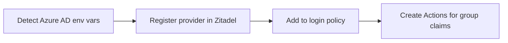

# Azure AD / Entra ID SSO Setup

This guide walks you through configuring Microsoft Azure AD (now Microsoft Entra ID) as an external identity provider for StackWeaver.

## Step 1: Register an Application in Azure AD

1. Sign in to the [Azure Portal](https://portal.azure.com).
2. Navigate to **Microsoft Entra ID** (formerly Azure Active Directory) > **App registrations**.
3. Click **New registration**.
4. Fill in the registration form:
   - **Name**: `StackWeaver` (or any descriptive name).
   - **Supported account types**: Choose based on your requirements. For most organizations, select "Accounts in this organizational directory only (Single tenant)".
   - **Redirect URI**: Select **Web** and enter your Zitadel callback URL:
     ```
     https://zitadel.example.com/idps/callback
     ```
     Replace `zitadel.example.com` with your actual Zitadel domain. For a localhost-only setup (no custom domain), use `http://localhost:8080/idps/callback`.
     See the [Custom Domain guide](../authentication/zitadel-custom-domain.md) for how the callback URL is constructed.
5. Click **Register**.

## Step 2: Create a Client Secret

1. In your newly registered application, go to **Certificates & secrets**.
2. Click **New client secret**.
3. Add a description (e.g., `StackWeaver SSO`) and choose an expiration period.
4. Click **Add**.
5. **Copy the client secret value immediately.** It will not be shown again.

## Step 3: Note Your Application Details

From the application's **Overview** page, note the following values:

| Field | Location | Example |
|-------|----------|---------|
| Application (client) ID | Overview page | `a1b2c3d4-e5f6-7890-abcd-ef1234567890` |
| Directory (tenant) ID | Overview page | `f0e1d2c3-b4a5-6789-0abc-def123456789` |
| Client Secret | Certificates & secrets | (the value you copied in Step 2) |

## Step 4: Configure Group Claims (Optional)

If you want to use automatic team mapping based on Azure AD group memberships:

1. In your app registration, go to **Token configuration**.
2. Click **Add groups claim**.
3. Select the group types to include:
   - **Security groups**: Recommended for most setups.
   - **Directory roles**: Optional.
   - **Groups assigned to the application**: Use this for fine-grained control.
4. Under **Customize token properties by type**, ensure **Group ID** is selected for the **ID** token type. You can also choose **sAMAccountName** or **Cloud-only group display names** if you prefer human-readable names as your `sso_team_id` values.
5. Click **Add**.

> **Note:** By default, Azure AD sends group Object IDs (GUIDs) in the `groups` claim. If you prefer readable names, select a different name format in Step 4. The values in the `groups` claim must match the `sso_team_id` values you configure on your StackWeaver teams.

## Step 5: Configure API Permissions

Ensure the application has the following API permissions:

1. Go to **API permissions**.
2. Verify these permissions exist (they should be added by default):
   - `Microsoft Graph` > `User.Read` (Delegated)
   - `openid` (Delegated)
   - `profile` (Delegated)
   - `email` (Delegated)
3. If they are missing, click **Add a permission** > **Microsoft Graph** > **Delegated permissions** and add them.

## Step 6: Configure StackWeaver

Choose the instructions for your deployment method.

### Docker Compose

Add the following variables to **`deploy/sso.env`** (this file is not overwritten by the auto-generated `deploy/.env`):

```bash
# Azure AD / Entra ID SSO Configuration
AZURE_AD_CLIENT_ID=a1b2c3d4-e5f6-7890-abcd-ef1234567890
AZURE_AD_CLIENT_SECRET=your-client-secret-value
AZURE_AD_TENANT_ID=f0e1d2c3-b4a5-6789-0abc-def123456789
```

If you omit `AZURE_AD_TENANT_ID`, StackWeaver will configure the provider in "common" multi-tenant mode, which allows any Azure AD tenant to authenticate. For most deployments, you should set the tenant ID to restrict access to your organization.

Then restart the `zitadel-init` service to apply the configuration:

```bash
cd deploy
docker compose up -d --build zitadel-init
```

### Kubernetes / Helm

Create a Kubernetes Secret with the client secret:

```bash
kubectl create secret generic stackweaver-sso \
  --namespace stackweaver \
  --from-literal=azure-ad-client-secret="your-client-secret-value"
```

Add the Azure AD configuration to your Helm values file:

```yaml
sso:
  secretName: stackweaver-sso
  azureAd:
    clientId: "a1b2c3d4-e5f6-7890-abcd-ef1234567890"
    tenantId: "f0e1d2c3-b4a5-6789-0abc-def123456789"
```

Then upgrade the release:

```bash
helm upgrade stackweaver oci://ghcr.io/vhco-pro/charts/stackweaver \
  --namespace stackweaver \
  --values my-values.yaml
```

### Verify the configuration

The `zitadel-init` service will automatically detect the Azure AD environment variables and configure everything:



<details>
<summary><strong>Flow Steps (Legend)</strong></summary>

1. **Register** - Registers the Azure AD provider in Zitadel with the name "Microsoft".
2. **Login policy** - Adds the provider to the login policy so the "Sign in with Microsoft" button appears.
3. **Actions** - Creates Zitadel Actions to capture and forward group claims through the JWT.

</details>

Check the logs to verify:

**Docker Compose:**
```bash
docker compose -f deploy/docker-compose.yml logs zitadel-init
```

**Kubernetes:**
```bash
kubectl logs -f deployment/stackweaver-zitadel -c zitadel-init --namespace stackweaver
```

Look for output like:
```
✅ Created Azure AD provider: <provider-id>
✅ Added Azure AD provider to login policy
✅ Created target 'stackweaver-idp-sync': <target-id>
✅ Created target 'stackweaver-complement-token': <target-id>
✅ Set execution: Response on RetrieveIdentityProviderIntent → IDP Sync webhook
✅ Set execution: Function preaccesstoken → Complement Token webhook
```

## Step 8: Test the Integration

1. Open StackWeaver in your browser (`http://localhost:5173`).
2. On the login page, you should see a "Sign in with Microsoft" button.
3. Click it to be redirected to Microsoft's login page.
4. Sign in with your Azure AD credentials.
5. On first login, Zitadel will auto-provision the user and redirect you back to StackWeaver.

After the first login, the user is provisioned in StackWeaver but does not have access to any organization. An admin must invite the user to an organization, or you can configure [team mapping](./team-mapping.md) for automatic access. 

## Provider Behavior

The Azure AD provider is configured with the following behaviors:

| Setting | Value | Description |
|---------|-------|-------------|
| Auto-creation | Enabled | New users are automatically created in Zitadel on first login |
| Auto-update | Enabled | User profile (name, email) is synced on each login |
| Account linking | Email-based | If a Zitadel user with the same email already exists, accounts are linked automatically |
| Email verification | Trusted | Azure AD emails are treated as verified (Azure AD does not send the `email_verified` claim) |
| Scopes | `openid`, `profile`, `email`, `User.Read` | Standard OIDC scopes plus Microsoft Graph basic profile |

## Troubleshooting

### "Sign in with Microsoft" button does not appear

Verify that the `AZURE_AD_CLIENT_ID` environment variable is set and non-empty. For Docker Compose, check `deploy/sso.env`. For Kubernetes, verify your Helm values have `sso.azureAd.clientId` set. Then re-run `zitadel-init` and check its logs for errors.

### Redirect URI mismatch error (AADSTS50011)

Zitadel constructs the callback URL from the HTTP request's domain context, not directly from the `ExternalDomain` config. The Stackweaver auth proxy (in the API container) must send the correct `x-zitadel-instance-host` header so that Zitadel builds the callback with your external domain. The expected format is:
```
https://{your-domain}/idps/callback
```

If the error shows `https://localhost:8080/idps/callback`, the `CUSTOM_REQUEST_HEADERS` on the API service is not set correctly. Verify the fix:

```bash
# Check that ZITADEL_EXTERNAL_HOST is set in .env
grep ZITADEL_EXTERNAL_HOST deploy/.env

# Check that the API container has the header configured
docker exec api sh -c 'printenv CUSTOM_REQUEST_HEADERS'
# Expected: x-zitadel-instance-host:zitadel.example.com
```

If missing, re-run `docker compose build zitadel-init && docker compose run --rm zitadel-init` to regenerate `.env`, then `make fresh`. See the [Custom Domain guide](../authentication/zitadel-custom-domain.md) for the full explanation of how callback URLs are constructed.

Also ensure the redirect URI registered in Azure Portal matches `https://your-domain/idps/callback` exactly.

### User creation failed on first SSO login

If you see a "Login failed" page with `error=user_creation_failed` in the URL, Zitadel could not auto-provision the user. The most common cause is a missing first or last name in the Azure AD profile. Zitadel requires a non-empty `GivenName` (first name) to create a user.

To fix this:

1. Ensure the Azure AD user has a first name and last name set in their profile (Azure Portal > Users > select user > Properties).
2. Verify that the Azure AD app registration has the `profile` scope in **API permissions** (Step 5). Without this scope, Azure AD may not include `given_name` and `family_name` claims in the token.
3. After fixing the profile, try the SSO login again.

### User is authenticated but has no organization access

This is expected behavior. SSO users are provisioned without organization membership for multi-tenant isolation. Either invite the user to an organization manually, or configure [team mapping](./team-mapping.md) to grant access automatically based on group claims.

### Group claims are not appearing

1. Verify you configured group claims in **Token configuration** (Step 4).
2. Check that the user is a member of at least one Azure AD group.
3. If you have more than 200 groups, Azure AD may return a link to the Graph API instead of inline groups. In that case, consider using "Groups assigned to the application" to limit the number of groups.

### Login page shows a blank or skeleton page

If the login page loads but shows only a blank skeleton, check the API container logs (the login UI is now bundled into the Stackweaver SPA, and Zitadel calls go through the auth proxy in the API container):

```bash
docker logs api 2>&1 | tail -50 | grep -iE 'auth|zitadel|proxy'
```

Common causes include the auth proxy failing to reach Zitadel (`curl http://localhost:8080/debug/healthz` should return 200) or a missing `ZITADEL_LOGIN_SERVICE_USER_TOKEN` in `deploy/.env` (the auth proxy refuses to start without a service-account PAT).

### "Errors.Target.DeniedURL" when configuring Actions (Kubernetes)

See the [SSO overview troubleshooting](./README.md#errorstargetdeniedurl-when-configuring-actions) for details and fix steps.
