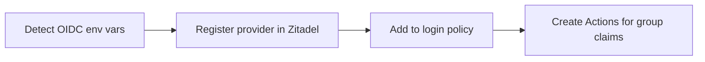

# Generic OIDC Provider Setup

This guide covers configuring any OIDC-compliant identity provider with StackWeaver. Use this guide if your provider is not Azure AD, Okta, or AWS Cognito, or if the provider-specific guides do not cover your setup.

Any identity provider that supports OpenID Connect with the Authorization Code flow can be integrated, including:

- Google Workspace
- Auth0
- Keycloak
- OneLogin
- PingIdentity
- JumpCloud
- Custom OIDC servers

## Prerequisites

Your OIDC provider must support:

1. **Authorization Code flow** with a client secret (confidential client).
2. **Standard OIDC discovery** via a `/.well-known/openid-configuration` endpoint at the issuer URL.
3. **Standard scopes**: `openid`, `profile`, `email`.

## Step 1: Register an Application

In your identity provider's admin console, create a new OIDC application:

1. Set the application type to **Web Application** (confidential client).
2. Set the **Redirect URI** / **Callback URL** to:
   ```
   https://zitadel.example.com/idps/callback
   ```
   Replace `zitadel.example.com` with your actual Zitadel domain. For a localhost-only setup, use `http://localhost:8080/idps/callback`. See the [Custom Domain guide](../zitadel-custom-domain.md) for how the callback URL is constructed.
3. Ensure the **Authorization Code** grant type is enabled.
4. Request the scopes: `openid`, `profile`, `email`.
5. Note the **Client ID** and **Client Secret**.

## Step 2: Find Your Issuer URL

The OIDC Issuer URL is the base URL that serves the `/.well-known/openid-configuration` document. You can verify it by opening the following URL in a browser:

```
{issuer}/.well-known/openid-configuration
```

It should return a JSON document with fields like `authorization_endpoint`, `token_endpoint`, and `userinfo_endpoint`.

Common issuer URL formats:

| Provider | Issuer URL Format |
|----------|-------------------|
| Auth0 | `https://{your-tenant}.auth0.com/` |
| Keycloak | `https://{host}/realms/{realm}` |
| Google | `https://accounts.google.com` |
| OneLogin | `https://{your-domain}.onelogin.com/oidc/2` |
| PingIdentity | `https://auth.pingone.com/{environment-id}/as` |

## Step 3: Configure Group Claims (Optional)

If you want automatic team mapping, configure your provider to include a `groups` claim in the ID token or the userinfo response. The exact steps vary by provider:

- **Auth0**: Use a [Post Login Action](https://auth0.com/docs/customize/actions/flows-and-triggers/login-flow) to add a `groups` claim from user roles or organization memberships.
- **Keycloak**: Add a "Group Membership" protocol mapper to your client with the claim name `groups`.
- **Google Workspace**: Group information is not available in standard OIDC claims. Consider using a middleware or a different approach.
- **OneLogin**: Configure a "Groups" parameter in the application's Parameters tab.

The claim must be a JSON array of strings. For example:
```json
{
  "groups": ["engineering", "platform-admins", "security"]
}
```

StackWeaver's IDP sync webhook extracts groups from multiple sources automatically. It checks the following claim names in order: `groups`, `cognito:groups`, `roles`, `group`, and Keycloak's `realm_access.roles`. It also inspects the OAuth `id_token` and `access_token` JWTs directly, which is needed for providers like Azure AD that include groups in the token but not in the userinfo response.

## Step 4: Configure StackWeaver

| Variable | Required | Description |
|----------|----------|-------------|
| `OIDC_IDP_NAME` | No | Display name shown on the login button (defaults to "SSO") |
| `OIDC_IDP_ISSUER` | Yes | The OIDC issuer URL (must serve `/.well-known/openid-configuration`) |
| `OIDC_IDP_CLIENT_ID` | Yes | OAuth 2.0 client ID from your provider |
| `OIDC_IDP_CLIENT_SECRET` | Yes | OAuth 2.0 client secret from your provider |

Choose the instructions for your deployment method.

### Docker Compose

Add the following variables to **`deploy/sso.env`** (this file is not overwritten by the auto-generated `deploy/.env`):

```bash
# Generic OIDC SSO Configuration
OIDC_IDP_NAME=My Provider
OIDC_IDP_ISSUER=https://your-provider.example.com
OIDC_IDP_CLIENT_ID=your-client-id
OIDC_IDP_CLIENT_SECRET=your-client-secret
```

Then restart the `zitadel-init` service:

```bash
cd deploy
docker compose up -d --build zitadel-init
```

### Kubernetes / Helm

Create a Kubernetes Secret with the client secret:

```bash
kubectl create secret generic stackweaver-sso \
  --namespace stackweaver \
  --from-literal=oidc-idp-client-secret="your-client-secret"
```

Add the OIDC provider configuration to your Helm values file:

```yaml
sso:
  secretName: stackweaver-sso
  oidcProvider:
    name: "My Provider"
    issuer: "https://your-provider.example.com"
    clientId: "your-client-id"
```

Then upgrade the release:

```bash
helm upgrade stackweaver oci://ghcr.io/vhco-pro/charts/stackweaver \
  --namespace stackweaver \
  --values my-values.yaml
```

### Verify the configuration

The `zitadel-init` service will detect the OIDC environment variables and configure everything:



<details>
<summary><strong>Flow Steps (Legend)</strong></summary>

1. **Register** — Registers the OIDC provider in Zitadel with the configured display name.
2. **Login policy** — Adds the provider to the login policy so the login button appears.
3. **Actions** — Creates Zitadel Actions to capture and forward group claims through the JWT.

</details>

Check the logs to verify:

**Docker Compose:**
```bash
docker compose -f deploy/docker-compose.yml logs zitadel-init
```

**Kubernetes:**
```bash
kubectl logs -f deployment/stackweaver-zitadel -c zitadel-init --namespace stackweaver
```

## Step 6: Test the Integration

1. Open StackWeaver in your browser.
2. On the login page, you should see a "Sign in with {OIDC_IDP_NAME}" button.
3. Click it to be redirected to your provider's login page.
4. Sign in with your credentials.
5. On first login, Zitadel auto-provisions the user and redirects you back to StackWeaver.

After first login, the user is provisioned but has no organization access. An admin must invite the user, or you can configure [team mapping](./team-mapping.md) for automatic access.

## Provider Behavior

| Setting | Value | Description |
|---------|-------|-------------|
| Auto-creation | Enabled | New users are automatically created in Zitadel on first login |
| Auto-update | Enabled | User profile is synced on each login |
| Account linking | Email-based | Existing users with matching email are automatically linked |
| Token mapping | Userinfo endpoint | Claims are read from the OIDC userinfo endpoint (not the ID token) |
| Scopes | `openid`, `profile`, `email` | Standard OIDC scopes |

## Limitations

### One Generic OIDC Provider at a Time

The environment variable-based configuration supports one Generic OIDC provider at a time. Azure AD uses a separate dedicated integration and can be configured alongside a Generic OIDC provider. This means you can have both Azure AD and one other OIDC provider active simultaneously.

If you need multiple Generic OIDC providers, you can configure additional providers directly through the Zitadel admin console.

### Userinfo Endpoint Required

StackWeaver configures the provider with `IsIdTokenMapping: false`, which means claims are read from the provider's userinfo endpoint rather than the ID token. Your provider must support the userinfo endpoint (most OIDC-compliant providers do).

## Troubleshooting

### Login button does not appear

Verify that `OIDC_IDP_CLIENT_ID` is set and non-empty. Re-run `zitadel-init` and check its logs.

### Discovery document errors

Verify your issuer URL serves a valid OIDC discovery document at `{issuer}/.well-known/openid-configuration`. Common issues include trailing slashes or incorrect paths.

### "Invalid redirect URI" error

Ensure the redirect URI in your provider's app configuration matches the callback URL that Zitadel uses:
```
https://{your-zitadel-domain}/idps/callback
```

The callback URL is constructed from the request's domain context, not directly from configuration. See the [Custom Domain guide](../zitadel-custom-domain.md) for details on how it works and how to verify it.

### Groups not appearing

1. Verify your provider sends a `groups` claim (as a JSON array of strings).
2. Check that the claim appears in the userinfo response, not just the ID token.
3. Some providers require explicit configuration to include group claims. See your provider's documentation.

### "Errors.Target.DeniedURL" when configuring Actions (Kubernetes)

See the [SSO overview troubleshooting](./README.md#errorstargetdeniedurl-when-configuring-actions) for details and fix steps.
