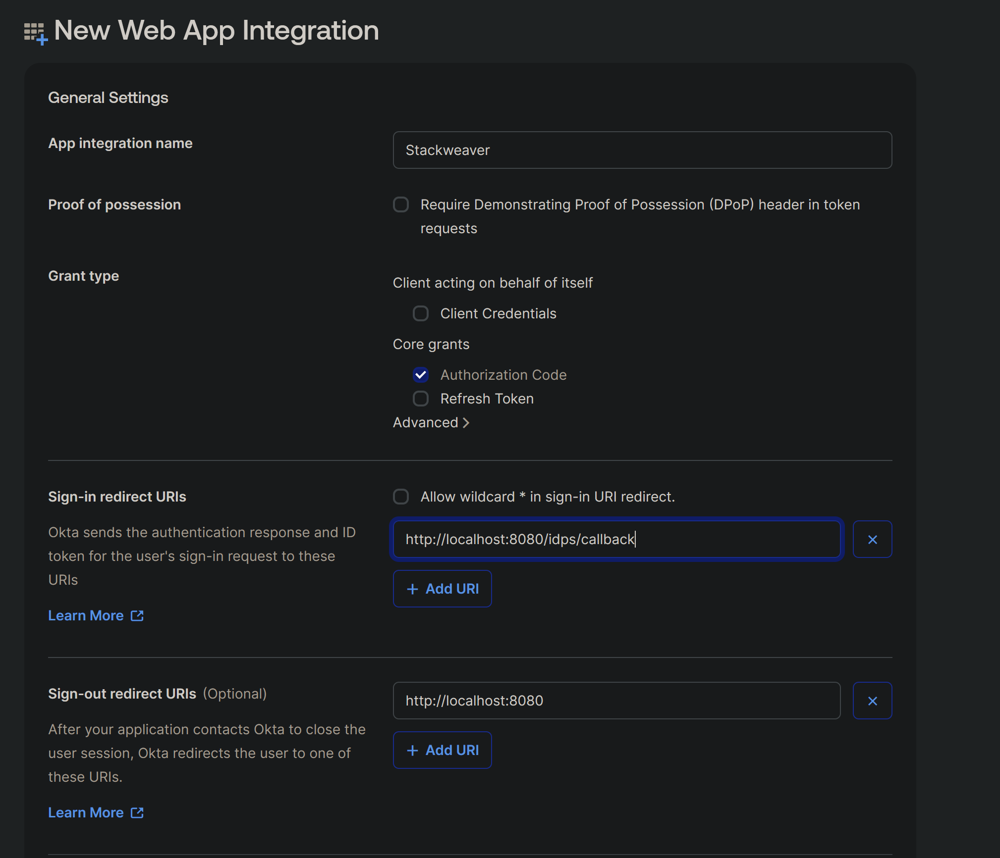

# Okta SSO Setup

This guide walks you through configuring Okta as an external identity provider for StackWeaver using the Generic OIDC integration.

## Step 1: Create an Application in Okta

1. Sign in to your [Okta Admin Console](https://admin.okta.com).
2. Navigate to **Applications** > **Applications**.
3. Click **Create App Integration**.
4. Select **OIDC - OpenID Connect** as the sign-in method.
5. Select **Web Application** as the application type.
6. Click **Next**.

## Step 2: Configure the Application

Fill in the application settings:

- **App integration name**: `StackWeaver`
- **Grant type**: Ensure **Authorization Code** is selected.
- **Sign-in redirect URIs**: Add your Zitadel callback URL:
  ```
  https://zitadel.example.com/idps/callback
  ```
  Replace `zitadel.example.com` with your actual Zitadel domain. For a localhost-only setup, use `http://localhost:8080/idps/callback`. See the [Custom Domain guide](../zitadel-custom-domain.md) for how the callback URL is constructed.
- **Sign-out redirect URIs**: Leave empty or add your StackWeaver frontend URL.
- **Assignments**: Choose who can use this application. Select **Allow everyone in your organization to access** for the broadest access, or limit to specific groups.

Click **Save**.



## Step 3: Note Your Application Details

After creating the application, note the following from the **General** tab:

| Field | Location | Example |
|-------|----------|---------|
| Client ID | General > Client Credentials | `0oa1a2b3c4d5e6f7g8h9` |
| Client Secret | General > Client Credentials | (click the copy icon) |
| Okta Domain | Your Okta org URL | `dev-12345678.okta.com` |

Your OIDC Issuer URL depends on which Okta authorization server you use. Okta has two types:

- **Custom Authorization Server** (recommended): `https://{your-okta-domain}/oauth2/default`. This supports custom claims (including groups) configured through the Okta admin console.
- **Org Authorization Server**: `https://{your-okta-domain}`. This does not support custom claims configured via Security > API > Authorization Servers, so group claims configured there will not take effect.

For group claim support, use the Custom Authorization Server issuer URL. For example: `https://dev-12345678.okta.com/oauth2/default`.

> [!IMPORTANT]
> If you have a URL with `-admin` in it, the `-admin` part must be left out when specifying the issuer URL.

## Step 4: Configure the Custom Authorization Server (Optional)

To forward group memberships to StackWeaver for automatic team assignment, you need to configure three things on your Okta Custom Authorization Server: a `groups` scope, a `groups` claim, and an access policy that covers your application.

Navigate to **Security** > **API** > **Authorization Servers** and select the **default** authorization server (or whichever custom authorization server your issuer URL points to).

### 4a. Add a `groups` scope

StackWeaver requests the `groups` scope when authenticating with Okta. This scope must exist on the authorization server, otherwise Okta will reject the request.

1. Go to the **Scopes** tab.
2. Click **Add Scope**.
3. Configure the scope:
   - **Name**: `groups`
   - **Description**: `Group memberships`
   - **Metadata**: leave unchecked
4. Click **Create**.

### 4b. Add a `groups` claim

This tells Okta to include group names in the ID token so StackWeaver can read them.

1. Go to the **Claims** tab.
2. Click **Add Claim**.
3. Configure the claim:
   - **Name**: `groups`
   - **Include in token type**: **ID Token** and **Always**
   - **Value type**: **Groups**
   - **Filter**: **Matches regex** with value `.*` (dot-star, not just `*`; a bare `*` is invalid regex and silently matches nothing)
4. Click **Create**.

### 4c. Configure the Access Policy

The Custom Authorization Server uses Access Policies to decide which applications can obtain tokens. Without a policy that covers your StackWeaver application, Okta returns a "Policy evaluation failed" error.

1. Go to the **Access Policies** tab.
2. If a default policy already exists (usually named "Default Policy"), click on it and verify your application is covered. The policy should be assigned to **All clients** or specifically to the StackWeaver application you created in Step 1.
3. If no policy exists, click **Add Policy**:
   - **Name**: `StackWeaver`
   - **Description**: `Access policy for StackWeaver SSO`
   - **Assign to**: **All clients** (or select the StackWeaver application specifically)
4. Inside the policy, click **Add Rule**:
   - **Name**: `Allow Authorization Code`
   - **Grant type is**: check **Authorization Code**
   - **User is**: **Any user assigned the app**
   - **Scopes requested**: **Any scopes**
   - Leave token lifetimes at their defaults
5. Click **Create Rule**.

## Mapping Okta Groups to Teams (TFE Provider)

After [configuring group claims](#step-4-configure-group-claims-optional) and [enabling team sync](./team-mapping.md#enabling-team-sync), you can create StackWeaver teams that automatically get members from Okta groups. Use the Terraform Enterprise provider’s `tfe_team` resource and set `sso_team_id` to the value Okta sends in the `groups` claim.

**Which value to use for `sso_team_id`:**  
Okta’s `groups` claim usually contains **group names** (the name shown in **Directory** → **Groups**). In that case, set `sso_team_id` to that exact name (case-sensitive). If you configured your Okta authorization server to put group **IDs** in the claim instead (e.g. via a custom claim with expression like `user.getGroups().getGroupIds()`), then use the group ID. You can see a group’s ID in the Okta Admin URL when you open the group (e.g. `.../admin/group/00g1a2b3c4d5e6f7g8h9`).

Example: you have an Okta group named **Engineering**. Create a team in Terraform and set `sso_team_id` to that name:

```hcl
terraform {
  required_providers {
    tfe = {
      source  = "hashicorp/tfe"
      version = "~> 0.72.0"
    }
  }
}

provider "tfe" {
  hostname = "stackweaver.example.com"  # Your StackWeaver hostname
  token    = var.stackweaver_token
}

resource "tfe_team" "engineering" {
  name         = "engineering"
  organization = "my-org"
  visibility   = "organization"

  # Must match the value Okta sends in the groups claim (usually the group name)
  sso_team_id = "Engineering"
}
```

After `terraform apply`, users in the Okta group **Engineering** are added to this team on their next SSO login. For more options (API, removal behavior, provider-specific details), see [SSO Team Mapping](./team-mapping.md).

## Step 5: Configure StackWeaver

Choose the instructions for your deployment method.

### Docker Compose

Add the following variables to **`deploy/sso.env`** (this file is not overwritten by the auto-generated `deploy/.env`):

```bash
# Okta SSO Configuration
OIDC_IDP_NAME=Okta
OIDC_IDP_ISSUER=https://dev-12345678.okta.com/oauth2/default
OIDC_IDP_CLIENT_ID=0oa1a2b3c4d5e6f7g8h9
OIDC_IDP_CLIENT_SECRET=your-client-secret-value
```

Replace the example values with your actual Okta application details.

Then restart the `zitadel-init` service:

```bash
cd deploy && docker compose up -d --build zitadel-init
```

### Kubernetes / Helm

Create a Kubernetes Secret with the client secret:

```bash
kubectl create secret generic stackweaver-sso \
  --namespace stackweaver \
  --from-literal=oidc-idp-client-secret="your-client-secret-value"
```

Add the Okta configuration to your Helm values file:

```yaml
sso:
  secretName: stackweaver-sso
  oidcProvider:
    name: "Okta"
    issuer: "https://dev-12345678.okta.com/oauth2/default"
    clientId: "0oa1a2b3c4d5e6f7g8h9"
```

Then upgrade the release:

```bash
helm upgrade stackweaver oci://ghcr.io/vhco-pro/charts/stackweaver \
  --namespace stackweaver \
  --values my-values.yaml
```

### Verify the configuration

The `zitadel-init` service will detect the OIDC environment variables and:

1. Register the OIDC provider in Zitadel with the name "Okta".
2. Add the provider to the login policy so a "Sign in with Okta" button appears.
3. Create Zitadel Actions to capture and forward group claims through the JWT.

Check the logs to verify:

**Docker Compose:**
```bash
docker compose -f deploy/docker-compose.yml logs zitadel-init
```

**Kubernetes:**
```bash
kubectl logs -f deployment/stackweaver-zitadel -c zitadel-init --namespace stackweaver
```

## Step 7: Test the Integration

1. Open StackWeaver in your browser.
2. On the login page, you should see a "Sign in with Okta" button.
3. Click it to be redirected to Okta's login page.
4. Sign in with your Okta credentials.
5. On first login, Zitadel auto-provisions the user and redirects you back to StackWeaver.

After the first login, the user is provisioned but does not have access to any organization. An admin must invite the user, or you can configure [team mapping](./team-mapping.md) for automatic access.

## Provider Behavior

| Setting | Value | Description |
|---------|-------|-------------|
| Auto-creation | Enabled | New users are automatically created in Zitadel on first login |
| Auto-update | Enabled | User profile is synced on each login |
| Account linking | Email-based | Existing users with matching email are automatically linked |
| Token mapping | Userinfo endpoint | Claims are read from the OIDC userinfo endpoint |
| Scopes | `openid`, `profile`, `email`, `groups` | Standard OIDC scopes plus groups for team sync |

## Troubleshooting

### Login button does not appear

Verify that `OIDC_IDP_CLIENT_ID` is set and non-empty in `deploy/sso.env`. Re-run `zitadel-init` and check the logs.

### "Invalid redirect URI" error from Okta

Ensure the redirect URI in your Okta app matches the callback URL that Zitadel uses:
```
https://{your-zitadel-domain}/idps/callback
```

The callback URL is constructed from the request's domain context, not directly from configuration. See the [Custom Domain guide](../zitadel-custom-domain.md) for details.

### User authenticated but no organization access

This is expected. SSO users are provisioned without organization membership. Either invite the user to an organization or configure [team mapping](./team-mapping.md).

### "Policy evaluation failed" error from Okta

This means the Custom Authorization Server's Access Policy does not cover your application. Follow [Step 4c](#4c-configure-the-access-policy) to add or update the access policy.

### "Invalid scope" or scope-related error from Okta

The `groups` scope must be explicitly defined on the Custom Authorization Server before it can be requested. Follow [Step 4a](#4a-add-a-groups-scope) to add it.

### Groups not appearing in StackWeaver

1. Verify you are using the Custom Authorization Server issuer URL (`/oauth2/default`), not the Org Authorization Server. The Org Authorization Server does not support custom claims.
2. Verify the `groups` scope and claim are both configured on the Custom Authorization Server (Step 4a and 4b).
3. Check that the user is assigned to at least one Okta group.
4. Use the Token Preview to verify the groups claim is working correctly:
   1. Go to **Security** > **API** > **Authorization Servers** > **default** > **Token Preview**.
   2. Set **OAuth/OIDC client** to your StackWeaver application, **Grant type** to **Authorization Code**, and select a test **User**.
   3. Add both `openid` and `groups` to the **Scopes** field (type each scope name and press enter).
   4. Click **Preview Token**. Two tabs appear in the result: **Token** (access token) and **ID Token**.
   5. Select the **ID Token** tab and look for a `"groups"` key in the payload. It should contain your group names, for example `"groups": ["Everyone"]`. Note that the **Token** tab shows the access token, which only has a `"scp"` field listing the granted scopes; this is not the same as the groups claim.
   6. If the `groups` claim is missing from the ID Token, go to the **Claims** tab and verify a claim named `groups` exists with **Value type** set to **Groups**, **Include in token type** set to **ID Token, Always**, and **Filter** set to **Matches regex** with value `.*`.

> **Note:** StackWeaver uses the Generic OIDC integration for Okta. If you need Azure AD, see the [Azure AD Setup Guide](./azure-ad.md) instead. Only one Generic OIDC provider can be configured at a time through environment variables.
