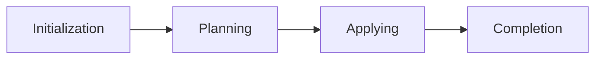

# Understanding OpenTofu Runs

Learn how to read plan and apply outputs, interpret resource changes, and make sense of your Terraform run history.

## What Are Runs?

A run is StackWeaver's term for executing Terraform. There are two main types:

- **Plans**: Show what Terraform would change (no actual changes made)
- **Applies**: Actually make the changes Terraform planned

Runs can also be plan-only, apply-only, or refresh-only depending on what you're trying to do.

## Reading Plan Output

When you queue a plan, Terraform analyzes your code and current state to determine what needs to change.

### The Plan Summary

At the top of every plan, you'll see a summary:

- **Resources to add**: New resources that will be created
- **Resources to change**: Existing resources that will be modified
- **Resources to destroy**: Resources that will be deleted

### Resource Change Cards

Each resource appears as a card showing:

- **Resource type and name**: Like `aws_instance.web_server`
- **Actions**: + for create, ~ for modify, - for destroy
- **Change summary**: What's changing (shown as a diff)

Expand any resource card to see:
- Full attribute diff
- Before and after values
- Any warnings or notes

### Understanding the Diff

Terraform shows changes using standard diff notation:

```
~ resource "aws_instance" "example" {
    ~ instance_type = "t2.micro" -> "t2.small"
      # (other attributes unchanged)
  }
```

The `~` means this attribute is being modified. You'll see the old value (`t2.micro`) and new value (`t2.small`).

### Plan-Only Runs

Sometimes you just want to see what would change without applying:

- **Speculative plans**: Run on pull requests to preview changes
- **Planning without applying**: Review changes before committing

> [!TIP]
> Plan-only runs are safe - they never modify your infrastructure.

### Run Task Stages

If the workspace has run tasks attached (external checks such as security scanners or cost gates), the run pauses at their configured stage boundaries and the run page shows each stage with its per-task results. An advisory task's failure is informational and the run continues; a mandatory task's failure holds the run until someone with apply permissions overrides it from the run page. See the [Run Tasks guide](run-tasks.md) for setting them up.

## Understanding Apply Output

Applies actually make the changes. The output is similar to plans but shows real-time progress.

### Real-Time Updates

During an apply:

1. Resources update in real-time as they're created/modified/destroyed
2. Status indicators show progress (queued → running → complete)
3. You can watch the live terminal output

### Apply Phases

Applies happen in phases:



<details>
<summary><strong>Flow Steps (Legend)</strong></summary>

1. **Initialization** - Terraform sets up and loads modules.
2. **Planning** - Terraform creates the execution plan (same as plan-only).
3. **Applying** - Changes are made to actual resources.
4. **Completion** - State is saved and outputs are available.

</details>

### Resource Status During Apply

As resources are applied, you'll see:

- **Pending**: Waiting to be processed
- **Creating/Updating/Destroying**: Currently being modified
- **Complete**: Successfully finished
- **Failed**: Something went wrong

Click any resource to see detailed apply logs.

## Reading Raw Output

Sometimes you need the full Terraform output. Switch to the "Raw Output" tab to see:

- **Plan output**: Full JSON or terminal output
- **Terminal view**: Exactly what you'd see running Terraform locally
- **JSON view**: Structured output for automation

> [!NOTE]
> The raw output is especially useful for debugging or when you need details not shown in the UI cards.

## Run History

Every run is saved so you can:

- **Review past plans**: See what was planned before an apply
- **Track changes over time**: Understand how your infrastructure evolved
- **Debug issues**: Compare failed runs to successful ones
- **Audit changes**: Know who made what changes and when

### Run Metadata

Each run shows:

- **Who triggered it**: User name or system (for PR plans)
- **When it ran**: Timestamp
- **Why it ran**: Source (manual, PR, scheduled, etc.)
- **Configuration version**: Git commit and branch
- **Duration**: How long the run took

## Common Scenarios

### Reviewing a Pull Request Plan

When you open a PR, StackWeaver automatically runs a speculative plan:

1. Check the plan summary - are the changes what you expected?
2. Review resource cards - any surprises?
3. Look for warnings - issues that won't fail but might cause problems
4. Share the plan link in PR comments for team review

### Understanding a Failed Run

If a run fails:

1. Check the error message at the top
2. Look for failed resources in red
3. Expand failed resources to see detailed error messages
4. Review the raw terminal output for full stack traces

Common failure reasons:
- **Invalid configuration**: Syntax errors or wrong resource types
- **Provider errors**: API issues or authentication problems
- **State conflicts**: Resources changed outside Terraform
- **Dependency issues**: Resources depending on non-existent resources

### Reviewing Past Runs

To understand what changed between runs, review the run history for the workspace. Each run includes its configuration version (Git commit), resource diffs, and metadata showing what triggered it.

## Tips for Effective Run Review

**Before applying:**

- Always review the plan summary first
- Expand and check resources marked for destruction
- Look for unexpected changes (might indicate drift or config issues)
- Check warnings even if they won't block the run

**After applying:**

- Verify the apply completed successfully
- Check any resources that show warnings
- Review the state version that was created
- Note any outputs that were generated

**For debugging:**

- Use raw output when UI cards don't show enough detail
- Check the terminal output for full error messages
- Compare to previous successful runs
- Look at the configuration version (Git commit) to see what changed

## Next Steps

- Learn about [managing workspace variables](./managing-workspace-variables.md)
- Explore [VCS path filtering](../features/opentofu/vcs-path-filtering.md) for automatic PR plans
- Read about [workspace editing](../features/opentofu/workspace-editing.md) to modify workspace settings
