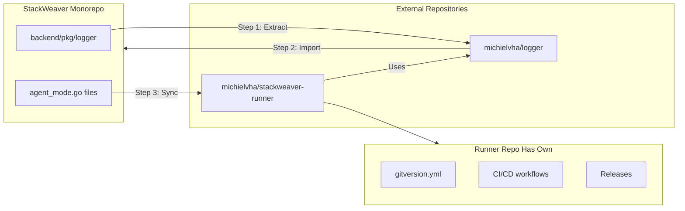

<!-- Copyright (c) 2025 VH & Co BV. Licensed under the Business Source License 1.1. See LICENSE for details. -->

---
name: Runner CI/CD and Extraction
overview: Extract logger to a reusable package, then sync self-hosted runner agent code to an open-source repository with its own versioning and release cycle.
todos:
  - id: extract-logger
    content: Extract backend/pkg/logger to github.com/michielvha/logger and publish initial version
    status: completed
  - id: import-logger
    content: Update stackweaver monorepo to import github.com/michielvha/logger instead of internal pkg/logger
    status: completed
  - id: publish-logger
    content: Push logger to GitHub, tag initial release, then remove replace directive from backend/go.mod
    status: pending
  - id: runner-implementation
    content: See runners-ci-implementation.md for runner repo setup and sync workflow
    status: pending
isProject: false
---

# Runner Open-Source Extraction Plan

## Strategy Overview

**Goal**: Maintain runner code centrally in the monorepo while syncing to an open-source repository for transparency and independent versioning/releases.

**Why separate repos instead of path-based tags?**
GitVersion is designed for single-repo versioning and doesn't natively support multi-component versioning with conventional commits. By syncing to a separate repo, each repository gets its own GitVersion config, conventional commits work naturally, and versioning/releases are independent.



## Part 1: Extract Logger Package

The logger package is a simple `log/slog` wrapper with zero external dependencies - ideal for reuse across Go projects.

**Source**: [backend/pkg/logger/logger.go](backend/pkg/logger/logger.go) (134 lines)

**Target**: https://github.com/michielvha/logger

### Logger Repository Structure

```
logger/
├── go.mod              # module github.com/michielvha/logger
├── logger.go           # Main logger implementation
├── gitversion.yml      # For independent versioning
├── LICENSE
└── README.md
```

### Implementation Steps

1. Initialize the logger repo with `go mod init github.com/michielvha/logger`
2. Copy `backend/pkg/logger/logger.go` content to `logger.go`
3. Add gitversion.yml (can copy from stackweaver, it uses conventional commits)
4. Add GitHub Actions for tagging (use `michielvha/gitversion-tag-action`)
5. Push and tag initial release (e.g., `0.1.0`)

### Update Monorepo

After publishing the logger:

1. Run `go get github.com/michielvha/logger@v0.1.0` in backend/
2. Update all imports from `github.com/iac-platform/backend/pkg/logger` to `github.com/michielvha/logger`
3. Optionally remove `backend/pkg/logger/` or keep as deprecated

Files to update imports in:
- `backend/cmd/runner/main.go`
- `backend/cmd/runner/agent_mode.go`
- `backend/cmd/ansible-runner/main.go`
- `backend/cmd/ansible-runner/agent_mode.go`
- `backend/cmd/api/main.go`
- `backend/cmd/orchestrator/main.go`
- Any other files importing the logger

## Part 2: Open-Source Runner Repository

### Why Open Source the Self-Hosted Runner?

- Transparency: Users can audit what runs on their infrastructure
- Trust: No black-box binaries
- Community: Potential contributions and issue reports
- Independent versioning: Runner releases don't need to match platform releases

### Runner Repository Structure

```
stackweaver-runner/
├── go.mod                          # module github.com/michielvha/stackweaver-runner
├── go.sum
├── gitversion.yml                  # Independent versioning with conventional commits
├── .github/
│   └── workflows/
│       ├── ci.yml                  # Lint/test
│       ├── tag.yml                 # GitVersion tagging
│       └── release.yml             # Docker builds with docker-release-action
├── cmd/
│   ├── stackweaver-runner/
│   │   └── main.go                 # Terraform runner entry point
│   └── stackweaver-ansible-runner/
│       └── main.go                 # Ansible runner entry point
├── internal/
│   ├── terraform/
│   │   └── agent.go                # From backend/cmd/runner/agent_mode.go
│   └── ansible/
│       └── agent.go                # From backend/cmd/ansible-runner/agent_mode.go
├── Dockerfile
├── Dockerfile.ansible
├── LICENSE                         # Apache 2.0 or similar
└── README.md
```

### Files to Sync from Monorepo

| Monorepo Source | Runner Repo Target | Lines |
|-----------------|-------------------|-------|
| `backend/cmd/runner/agent_mode.go` | `internal/terraform/agent.go` | ~560 |
| `backend/cmd/ansible-runner/agent_mode.go` | `internal/ansible/agent.go` | ~736 |

**Total**: ~1,300 lines of self-contained code

## Part 3: GitHub Actions Sync Workflow

Create a workflow in the monorepo that syncs runner code to the open-source repo when changes are detected.

### Sync Workflow Design

**Trigger**: Push to main with changes in:
- `backend/cmd/runner/agent_mode.go`
- `backend/cmd/ansible-runner/agent_mode.go`

**Process**:
1. Checkout both repos
2. Copy and transform files (update package names, imports)
3. Commit and push to open-source repo
4. Open-source repo's CI handles versioning and releases

### Workflow Location

Create: `.github/workflows/sync-runner.yml`

### Required Secrets

- `RUNNER_REPO_TOKEN`: PAT or fine-grained token with push access to the runner repo

### Import Path Transformation

The sync workflow needs to transform:
- `package main` → `package terraform` or `package ansible`
- `github.com/iac-platform/backend/pkg/logger` → `github.com/michielvha/logger`
- Function exports (e.g., `RunAgentMode` stays exported)

## Part 4: Versioning Strategy

### Monorepo (stackweaver)
- Continues using existing gitversion.yml
- Versions the platform as a whole
- Conventional commits: `feat:`, `fix:`, etc.

### Logger Repo (michielvha/logger)
- Own gitversion.yml
- Independent versioning
- Likely slow-moving, stable API

### Runner Repo (stackweaver-runner)
- Own gitversion.yml with same conventional commit patterns
- Independent versioning from platform
- Releases triggered by commits synced from monorepo
- Docker builds use `michielvha/docker-release-action`

### Version Flow Example

```
Monorepo commit: "feat(runner): add retry logic"
    ↓
Sync workflow triggers
    ↓
Runner repo receives commit (preserves message)
    ↓
Runner repo GitVersion bumps minor version
    ↓
Runner repo release workflow builds Docker image
```

## Implementation Order

1. **Extract logger** → Publish to `michielvha/logger`
2. **Import logger in monorepo** → Update all imports, verify builds
3. **Create runner repo structure** → Set up skeleton, gitversion, CI
4. **Create sync workflow** → In monorepo, syncs to runner repo
5. **Add release workflow to runner repo** → Docker builds with docker-release-action (later)

