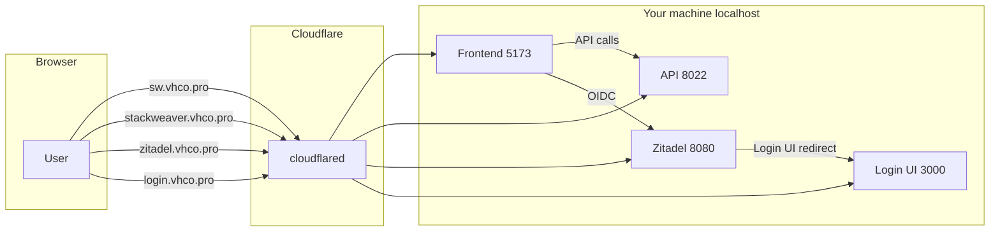

<!-- Copyright (c) 2025 VH & Co BV. Licensed under the Business Source License 1.1. See LICENSE for details. -->

# Expose StackWeaver dev stack via Cloudflare Tunnel

**Status:** ✅ Implemented — `deploy/docker-compose.tunnel.yml` exists; `make up-tunnel` works.

Expose the dev stack to the internet so clients can see a live environment, while keeping localhost as the default for day-to-day development. One Cloudflare Tunnel, no nginx, no manual steps.

## Hostnames

| Service   | Port | Tunnel hostname        |
| --------- | ---- | ---------------------- |
| Frontend  | 5173 | sw.vhco.pro            |
| API       | 8022 | stackweaver.vhco.pro   |
| Zitadel   | 8080 | zitadel.vhco.pro       |
| Login UI  | 3000 | login.vhco.pro         |

Postgres, Redis, MinIO, orchestrator, and runners stay internal.

## Usage

```bash
make up            # localhost only (default)
make up-tunnel     # exposed via tunnel
make down          # stops either mode
```

`make up-tunnel` uses [deploy/docker-compose.tunnel.yml](deploy/docker-compose.tunnel.yml) as an override on top of the base compose file. It sets only what the browser needs:

- **Frontend**: `VITE_API_URL`, `VITE_ZITADEL_REDIRECT_URI` point at the public API and callback URL.
- **API**: `CORS_EXTRA_ORIGINS` allows `https://sw.vhco.pro`.
- **Zitadel**: `ZITADEL_LOGIN_UI_BASE_URL` and `ZITADEL_LOGIN_UI_ORIGIN` point at `login.vhco.pro`.

Everything else (API talking to Zitadel, Redis, Postgres, MinIO) stays on localhost. `make up` is unchanged.

### Why only the frontend URLs change

The frontend runs in the visitor's browser. If `VITE_API_URL` is `http://localhost:8022`, the browser calls localhost on the visitor's machine, not the dev box. So for tunnel access, the frontend build must point at the public API/Zitadel URLs (which cloudflared routes back to your machine).

Server-to-server communication stays on localhost because those processes all run on the same host.

### Dual run (localhost + domain)

When running with `make up-tunnel`, both access methods work:

- **Local**: `http://localhost:5173` -- the frontend calls `stackweaver.vhco.pro` / `zitadel.vhco.pro` for API/OIDC; cloudflared resolves those to your machine.
- **Tunnel**: `https://sw.vhco.pro` -- same build, same behavior, works from anywhere.

## Implementation

### Files changed

- [backend/internal/api/middleware/cors.go](backend/internal/api/middleware/cors.go) -- reads `CORS_EXTRA_ORIGINS` env var (comma-separated) and appends to the allowed-origins list. Empty by default.

- [deploy/docker-compose.yml](deploy/docker-compose.yml) -- frontend, API, and Zitadel env vars use `${VAR:-default}` so they can be overridden. Defaults are all localhost, so `make up` is unchanged.

- [deploy/docker-compose.tunnel.yml](deploy/docker-compose.tunnel.yml) -- override file that sets tunnel-specific env vars for frontend, API, and Zitadel services.

- [deploy/cloudflared-config.example.yml](deploy/cloudflared-config.example.yml) -- example cloudflared config with all four ingress rules.

- [deploy/zitadel-init.yaml](deploy/zitadel-init.yaml) -- added `frontend_redirect_uris` and `frontend_post_logout_redirect_uris` for the tunnel callback URL.

- [scripts/zitadel-init/main.go](scripts/zitadel-init/main.go) -- `GetOrCreateFrontendApp` now reads extra redirect URIs from `zitadel-init.yaml` and automatically adds them to the Zitadel frontend OIDC app (both on create and on existing apps via `UpdateApplication`).

- [Makefile](Makefile) -- added `make up-tunnel`.

### Files NOT changed

- `deploy/.env` -- auto-generated by zitadel-init, untouched.
- `deploy/zitadel-defaults.yaml` -- `ExternalDomain`, `BaseURI` stay as-is. The tunnel override handles login-ui via docker-compose env.

### Cloudflare Tunnel config

The live cloudflared config at `/etc/cloudflared/config.yml` has all four ingress rules. DNS CNAMEs for `sw.vhco.pro` and `login.vhco.pro` have been routed to the existing tunnel (`api-tunnel`).

## Architecture


